# System Architecture and Design

**Project:** SerialyTTY - Professional USB-TTL Bridge  
**Version:** 1.1.0  
**Last Updated:** December 14, 2025  
**Document Type:** Technical Architecture  
**Audience:** Software Engineers, System Architects, Technical Stakeholders

---

## Document Purpose

This architecture document provides a comprehensive technical blueprint of the SerialyTTY system. It serves as the authoritative reference for:

- **System Design Decisions** - Rationale behind architectural choices
- **Component Interactions** - How modules communicate and collaborate
- **Data Flow Patterns** - Information movement through the system
- **Integration Points** - External interfaces and protocols
- **Scalability Considerations** - Future extensibility and growth

**Target Readers:**
- Software engineers implementing new features
- System architects evaluating design patterns
- Technical reviewers assessing system quality
- Integration teams working with SerialyTTY
- Stakeholders requiring technical understanding

---

## Table of Contents

1. [System Overview](#system-overview) - High-level system description and design principles
2. [High-Level Architecture](#high-level-architecture) - C4 model context and container diagrams
3. [Component Architecture](#component-architecture) - Layered architecture and component responsibilities
4. [Data Flow Diagrams](#data-flow-diagrams) - Level 0/1 DFDs and bridge mode data flow
5. [State Machine Design](#state-machine-design) - Main application and BLE connection states
6. [Module Interactions](#module-interactions) - Initialization, detection, and command sequences
7. [Hardware Architecture](#hardware-architecture) - Physical components and pin multiplexing
8. [Software Stack](#software-stack) - Technology layers and memory architecture
9. [Class Diagrams](#class-diagrams) - Object-oriented design and relationships
10. [Sequence Diagrams](#sequence-diagrams) - Temporal interactions and workflows
11. [Deployment Architecture](#deployment-architecture) - CI/CD pipeline and runtime deployment
12. [Performance Characteristics](#performance-characteristics) - Timing and throughput analysis
13. [Security Architecture](#security-architecture) - Multi-layer security model

---

## System Overview

### Project Context

SerialyTTY is an intelligent USB-to-TTL serial bridge built on ESP32-C6 that addresses critical challenges in embedded systems development:

**Problem Statement:**
- Unknown baud rates complicate device communication
- Manual baud rate testing is time-consuming and error-prone
- Field debugging requires physical access to devices
- Serial data analysis needs comprehensive logging
- Traditional tools lack wireless control capabilities

**Solution Approach:**
- **Automatic Baud Detection:** GPIO interrupt-based timing analysis (9600-115200 bps)
- **Wireless Control:** BLE remote operation via Nordic UART Service
- **Visual Feedback:** Real-time TFT display with LVGL graphics
- **Comprehensive Logging:** Timestamped SD card data capture
- **Modular Design:** Graceful degradation without optional peripherals

### Design Principles

The architecture is guided by these core principles:

| Principle | Implementation | Benefit |
|-----------|----------------|----------|
| **Modularity** | Loosely coupled components with clear interfaces | Easy to extend and maintain |
| **Graceful Degradation** | System functions without optional peripherals | Flexible deployment options |
| **Real-Time Operation** | FreeRTOS for concurrent task management | Deterministic performance |
| **Hardware Abstraction** | Platform-independent core logic | Portable across ESP32 variants |
| **Event-Driven** | Interrupt-based GPIO and BLE event handling | Low latency, efficient CPU usage |
| **Fail-Safe** | Comprehensive error handling and recovery | High reliability in field use |

### Key Architectural Decisions

**ADR-001: ESP32-C6 Platform Selection**
- **Decision:** Use ESP32-C6 with RISC-V architecture
- **Rationale:** Built-in BLE 5.0, sufficient GPIO, strong ecosystem, cost-effective
- **Trade-offs:** Limited to ESP-IDF ecosystem, but gains community support

**ADR-002: Interrupt-Based Baud Detection**
- **Decision:** GPIO interrupt timing analysis vs. brute-force testing
- **Rationale:** Faster (2-5s vs. 30-60s), more accurate, hardware-agnostic
- **Trade-offs:** More complex implementation, requires calibration

**ADR-003: Nordic UART Service for BLE**
- **Decision:** Use standardized NUS vs. custom BLE service
- **Rationale:** Compatibility with existing apps, proven protocol, no custom app needed
- **Trade-offs:** Limited to serial-style communication, but sufficient for use case

**ADR-004: LVGL Graphics Framework**
- **Decision:** LVGL 9.4.0 for display management
- **Rationale:** Mature, feature-rich, active community, excellent documentation
- **Trade-offs:** Higher memory usage (~64 KB), but provides professional UI

---

## High-Level Architecture

### System Context Diagram

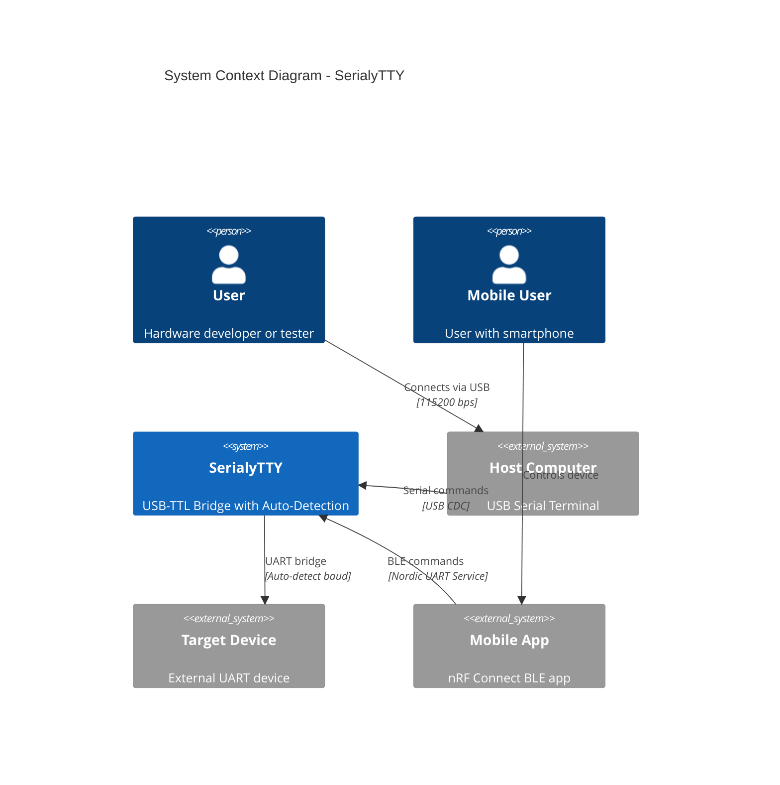
```mermaid
C4Context
    title System Context Diagram - SerialyTTY

    Person(user, "User", "Hardware developer or tester")
    Person(mobile_user, "Mobile User", "User with smartphone")
    
    System(serialytty, "SerialyTTY", "USB-TTL Bridge with Auto-Detection")
    
    System_Ext(computer, "Host Computer", "USB Serial Terminal")
    System_Ext(target, "Target Device", "External UART device")
    System_Ext(mobile, "Mobile App", "nRF Connect BLE app")
    
    Rel(user, computer, "Connects via USB", "115200 bps")
    Rel(computer, serialytty, "Serial commands", "USB CDC")
    Rel(serialytty, target, "UART bridge", "Auto-detect baud")
    Rel(mobile_user, mobile, "Controls device")
    Rel(mobile, serialytty, "BLE commands", "Nordic UART Service")
```

### Container Diagram

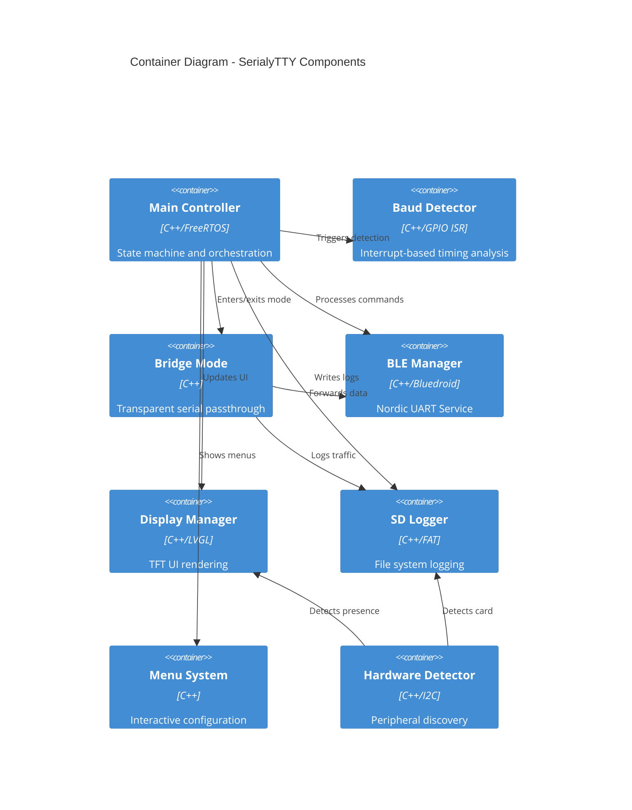
```mermaid
C4Container
    title Container Diagram - SerialyTTY Components

    Container(main, "Main Controller", "C++/FreeRTOS", "State machine and orchestration")
    Container(baud, "Baud Detector", "C++/GPIO ISR", "Interrupt-based timing analysis")
    Container(bridge, "Bridge Mode", "C++", "Transparent serial passthrough")
    Container(ble, "BLE Manager", "C++/Bluedroid", "Nordic UART Service")
    Container(display, "Display Manager", "C++/LVGL", "TFT UI rendering")
    Container(sd, "SD Logger", "C++/FAT", "File system logging")
    Container(menu, "Menu System", "C++", "Interactive configuration")
    Container(hw, "Hardware Detector", "C++/I2C", "Peripheral discovery")
    
    Rel(main, baud, "Triggers detection")
    Rel(main, bridge, "Enters/exits mode")
    Rel(main, ble, "Processes commands")
    Rel(main, display, "Updates UI")
    Rel(main, sd, "Writes logs")
    Rel(main, menu, "Shows menus")
    Rel(hw, display, "Detects presence")
    Rel(hw, sd, "Detects card")
    Rel(bridge, ble, "Forwards data")
    Rel(bridge, sd, "Logs traffic")
```

---

## Component Architecture

### Layered Architecture

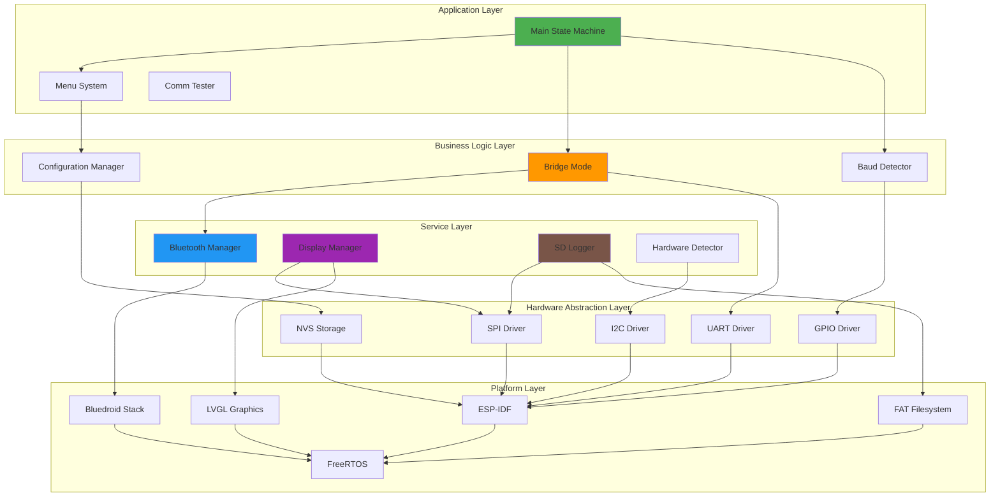
```mermaid
graph TB
    subgraph "Application Layer"
        MAIN[Main State Machine]
        MENU[Menu System]
        TEST[Comm Tester]
    end
    
    subgraph "Business Logic Layer"
        BAUD[Baud Detector]
        BRIDGE[Bridge Mode]
        CONFIG[Configuration Manager]
    end
    
    subgraph "Service Layer"
        BLE[Bluetooth Manager]
        DISPLAY[Display Manager]
        SD[SD Logger]
        HW[Hardware Detector]
    end
    
    subgraph "Hardware Abstraction Layer"
        UART[UART Driver]
        GPIO[GPIO Driver]
        SPI[SPI Driver]
        I2C[I2C Driver]
        NVS[NVS Storage]
    end
    
    subgraph "Platform Layer"
        FREERTOS[FreeRTOS]
        ESPIDF[ESP-IDF]
        BLUEDROID[Bluedroid Stack]
        LVGL[LVGL Graphics]
        FATFS[FAT Filesystem]
    end
    
    MAIN --> BAUD
    MAIN --> BRIDGE
    MAIN --> MENU
    MENU --> CONFIG
    
    BAUD --> GPIO
    BRIDGE --> UART
    BRIDGE --> BLE
    BLE --> BLUEDROID
    DISPLAY --> LVGL
    DISPLAY --> SPI
    SD --> FATFS
    SD --> SPI
    HW --> I2C
    CONFIG --> NVS
    
    UART --> ESPIDF
    GPIO --> ESPIDF
    SPI --> ESPIDF
    I2C --> ESPIDF
    NVS --> ESPIDF
    
    ESPIDF --> FREERTOS
    LVGL --> FREERTOS
    BLUEDROID --> FREERTOS
    FATFS --> FREERTOS
    
    style MAIN fill:#4CAF50
    style BLE fill:#2196F3
    style BRIDGE fill:#FF9800
    style DISPLAY fill:#9C27B0
    style SD fill:#795548
```

### Component Responsibilities

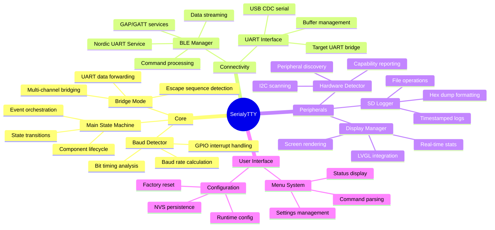
```mermaid
mindmap
    root((SerialyTTY))
        Core
            Main State Machine
                State transitions
                Event orchestration
                Component lifecycle
            Baud Detector
                GPIO interrupt handling
                Bit timing analysis
                Baud rate calculation
            Bridge Mode
                UART data forwarding
                Escape sequence detection
                Multi-channel bridging
        Connectivity
            BLE Manager
                GAP/GATT services
                Nordic UART Service
                Command processing
                Data streaming
            UART Interface
                USB CDC serial
                Target UART bridge
                Buffer management
        Peripherals
            Display Manager
                LVGL integration
                Screen rendering
                Real-time stats
            SD Logger
                File operations
                Timestamped logs
                Hex dump formatting
            Hardware Detector
                I2C scanning
                Peripheral discovery
                Capability reporting
        User Interface
            Menu System
                Command parsing
                Settings management
                Status display
            Configuration
                NVS persistence
                Runtime config
                Factory reset
```

---

## Data Flow Diagrams

### Level 0: System Context Data Flow

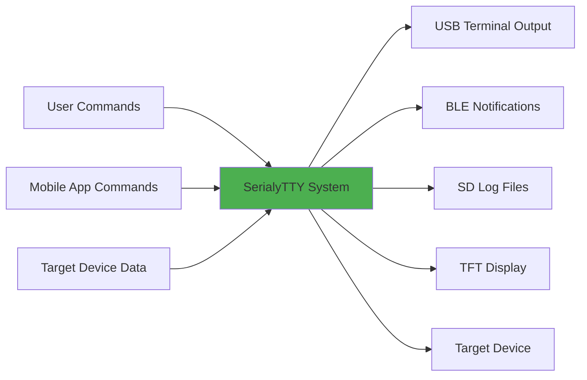
```mermaid
flowchart LR
    USER[User Commands]
    MOBILE[Mobile App Commands]
    TARGET[Target Device Data]
    
    SYSTEM[SerialyTTY System]
    
    USB_OUT[USB Terminal Output]
    BLE_OUT[BLE Notifications]
    SD_OUT[SD Log Files]
    DISPLAY_OUT[TFT Display]
    TARGET_OUT[Target Device]
    
    USER --> SYSTEM
    MOBILE --> SYSTEM
    TARGET --> SYSTEM
    
    SYSTEM --> USB_OUT
    SYSTEM --> BLE_OUT
    SYSTEM --> SD_OUT
    SYSTEM --> DISPLAY_OUT
    SYSTEM --> TARGET_OUT
    
    style SYSTEM fill:#4CAF50
```

### Level 1: Main Data Flow

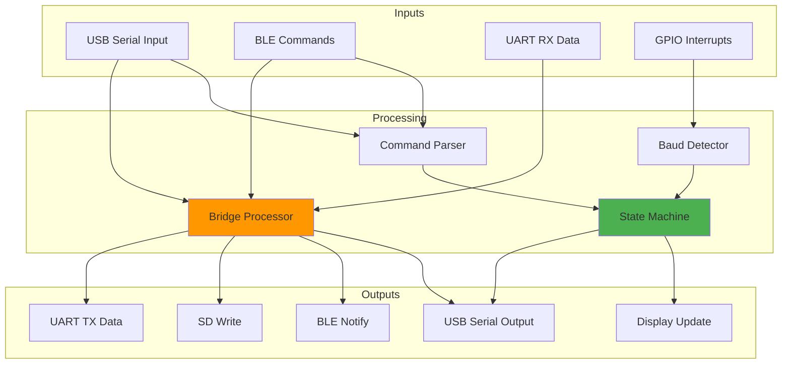
```mermaid
flowchart TB
    subgraph Inputs
        USB_IN[USB Serial Input]
        BLE_IN[BLE Commands]
        UART_IN[UART RX Data]
        GPIO_IN[GPIO Interrupts]
    end
    
    subgraph Processing
        PARSER[Command Parser]
        STATE[State Machine]
        DETECTOR[Baud Detector]
        BRIDGE_PROC[Bridge Processor]
    end
    
    subgraph Outputs
        USB_OUT[USB Serial Output]
        BLE_OUT[BLE Notify]
        UART_OUT[UART TX Data]
        DISPLAY_OUT[Display Update]
        SD_OUT[SD Write]
    end
    
    USB_IN --> PARSER
    BLE_IN --> PARSER
    PARSER --> STATE
    
    GPIO_IN --> DETECTOR
    DETECTOR --> STATE
    
    UART_IN --> BRIDGE_PROC
    BRIDGE_PROC --> USB_OUT
    BRIDGE_PROC --> BLE_OUT
    BRIDGE_PROC --> SD_OUT
    
    STATE --> DISPLAY_OUT
    STATE --> USB_OUT
    
    USB_IN --> BRIDGE_PROC
    BLE_IN --> BRIDGE_PROC
    BRIDGE_PROC --> UART_OUT
    
    style STATE fill:#4CAF50
    style BRIDGE_PROC fill:#FF9800
```

### Bridge Mode Data Flow

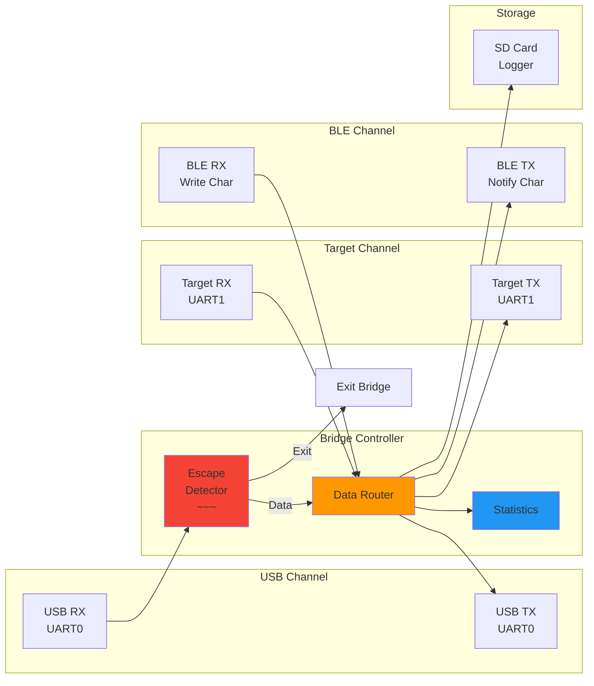
```mermaid
flowchart LR
    subgraph "USB Channel"
        USB_RX[USB RX<br/>UART0]
        USB_TX[USB TX<br/>UART0]
    end
    
    subgraph "Bridge Controller"
        ESCAPE[Escape<br/>Detector<br/>~~~]
        ROUTER[Data Router]
        STATS[Statistics]
    end
    
    subgraph "Target Channel"
        TARGET_RX[Target RX<br/>UART1]
        TARGET_TX[Target TX<br/>UART1]
    end
    
    subgraph "BLE Channel"
        BLE_RX[BLE RX<br/>Write Char]
        BLE_TX[BLE TX<br/>Notify Char]
    end
    
    subgraph "Storage"
        SD_LOG[SD Card<br/>Logger]
    end
    
    USB_RX --> ESCAPE
    ESCAPE -->|Data| ROUTER
    ESCAPE -->|Exit| EXIT[Exit Bridge]
    
    BLE_RX --> ROUTER
    
    ROUTER --> TARGET_TX
    TARGET_RX --> ROUTER
    
    ROUTER --> USB_TX
    ROUTER --> BLE_TX
    ROUTER --> SD_LOG
    ROUTER --> STATS
    
    style ROUTER fill:#FF9800
    style ESCAPE fill:#F44336
    style STATS fill:#2196F3
```

---

## State Machine Design

### Main State Machine

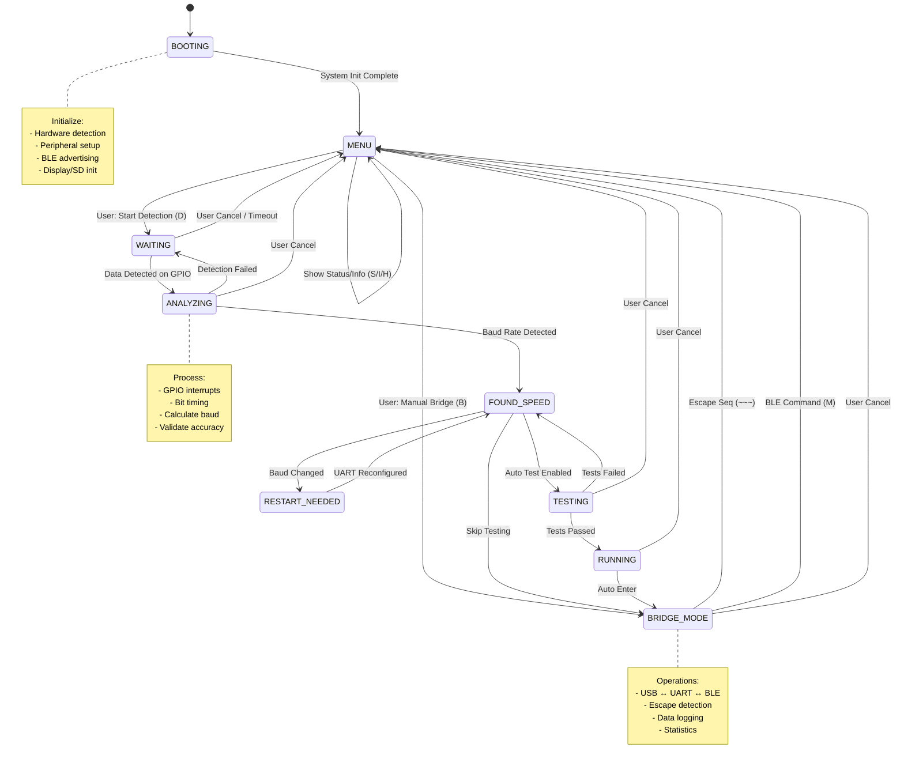
```mermaid
stateDiagram-v2
    [*] --> BOOTING
    
    BOOTING --> MENU : System Init Complete
    
    MENU --> WAITING : User: Start Detection (D)
    MENU --> BRIDGE_MODE : User: Manual Bridge (B)
    MENU --> MENU : Show Status/Info (S/I/H)
    
    WAITING --> ANALYZING : Data Detected on GPIO
    WAITING --> MENU : User Cancel / Timeout
    
    ANALYZING --> FOUND_SPEED : Baud Rate Detected
    ANALYZING --> WAITING : Detection Failed
    ANALYZING --> MENU : User Cancel
    
    FOUND_SPEED --> RESTART_NEEDED : Baud Changed
    FOUND_SPEED --> TESTING : Auto Test Enabled
    FOUND_SPEED --> BRIDGE_MODE : Skip Testing
    
    RESTART_NEEDED --> FOUND_SPEED : UART Reconfigured
    
    TESTING --> RUNNING : Tests Passed
    TESTING --> FOUND_SPEED : Tests Failed
    TESTING --> MENU : User Cancel
    
    RUNNING --> BRIDGE_MODE : Auto Enter
    RUNNING --> MENU : User Cancel
    
    BRIDGE_MODE --> MENU : Escape Seq (~~~)
    BRIDGE_MODE --> MENU : BLE Command (M)
    BRIDGE_MODE --> MENU : User Cancel
    
    note right of BOOTING
        Initialize:
        - Hardware detection
        - Peripheral setup
        - BLE advertising
        - Display/SD init
    end note
    
    note right of ANALYZING
        Process:
        - GPIO interrupts
        - Bit timing
        - Calculate baud
        - Validate accuracy
    end note
    
    note right of BRIDGE_MODE
        Operations:
        - USB ↔ UART ↔ BLE
        - Escape detection
        - Data logging
        - Statistics
    end note
```

### BLE Connection State Machine

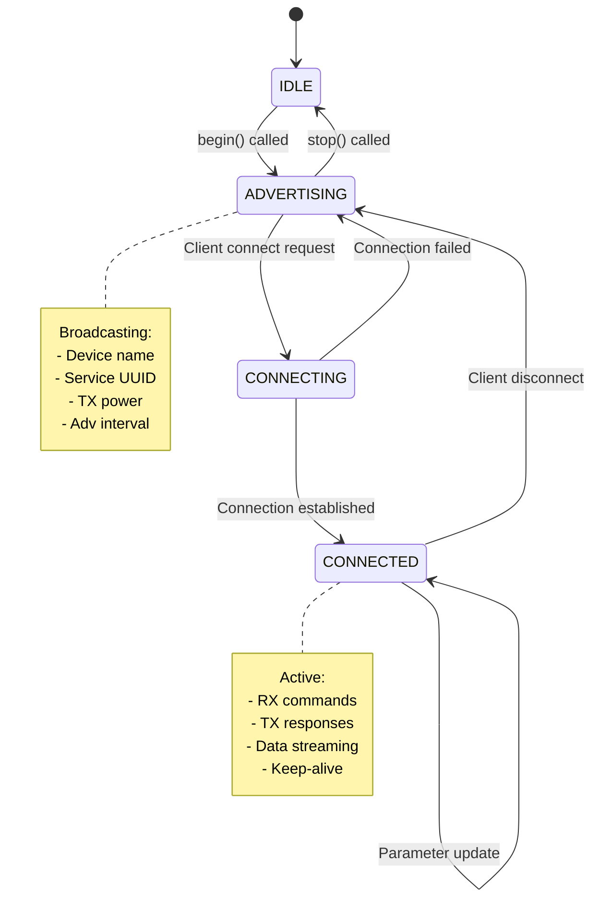
```mermaid
stateDiagram-v2
    [*] --> IDLE
    
    IDLE --> ADVERTISING : begin() called
    
    ADVERTISING --> CONNECTING : Client connect request
    ADVERTISING --> IDLE : stop() called
    
    CONNECTING --> CONNECTED : Connection established
    CONNECTING --> ADVERTISING : Connection failed
    
    CONNECTED --> CONNECTED : Data transfer
    CONNECTED --> CONNECTED : MTU negotiation
    CONNECTED --> CONNECTED : Parameter update
    CONNECTED --> ADVERTISING : Client disconnect
    
    note right of ADVERTISING
        Broadcasting:
        - Device name
        - Service UUID
        - TX power
        - Adv interval
    end note
    
    note right of CONNECTED
        Active:
        - RX commands
        - TX responses
        - Data streaming
        - Keep-alive
    end note
```

---

## Module Interactions

### Initialization Sequence

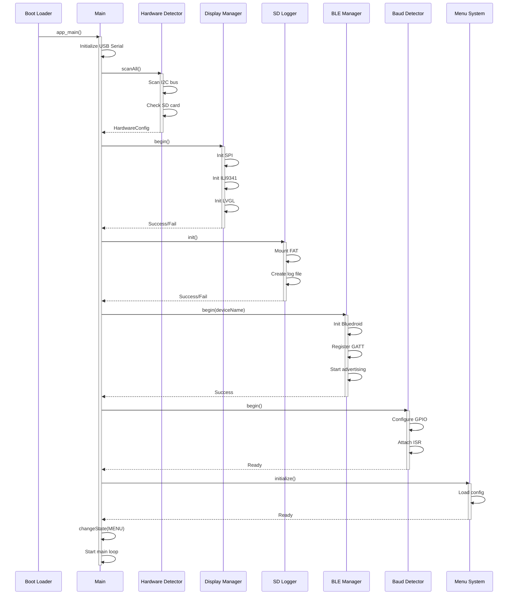
```mermaid
sequenceDiagram
    participant BOOT as Boot Loader
    participant MAIN as Main
    participant HW as Hardware Detector
    participant DISP as Display Manager
    participant SD as SD Logger
    participant BLE as BLE Manager
    participant BAUD as Baud Detector
    participant MENU as Menu System
    
    BOOT->>MAIN: app_main()
    activate MAIN
    
    MAIN->>MAIN: Initialize USB Serial
    MAIN->>HW: scanAll()
    activate HW
    HW->>HW: Scan I2C bus
    HW->>HW: Check SD card
    HW-->>MAIN: HardwareConfig
    deactivate HW
    
    MAIN->>DISP: begin()
    activate DISP
    DISP->>DISP: Init SPI
    DISP->>DISP: Init ILI9341
    DISP->>DISP: Init LVGL
    DISP-->>MAIN: Success/Fail
    deactivate DISP
    
    MAIN->>SD: init()
    activate SD
    SD->>SD: Mount FAT
    SD->>SD: Create log file
    SD-->>MAIN: Success/Fail
    deactivate SD
    
    MAIN->>BLE: begin(deviceName)
    activate BLE
    BLE->>BLE: Init Bluedroid
    BLE->>BLE: Register GATT
    BLE->>BLE: Start advertising
    BLE-->>MAIN: Success
    deactivate BLE
    
    MAIN->>BAUD: begin()
    activate BAUD
    BAUD->>BAUD: Configure GPIO
    BAUD->>BAUD: Attach ISR
    BAUD-->>MAIN: Ready
    deactivate BAUD
    
    MAIN->>MENU: initialize()
    activate MENU
    MENU->>MENU: Load config
    MENU-->>MAIN: Ready
    deactivate MENU
    
    MAIN->>MAIN: changeState(MENU)
    MAIN->>MAIN: Start main loop
    
    deactivate MAIN
```

### Baud Detection Sequence

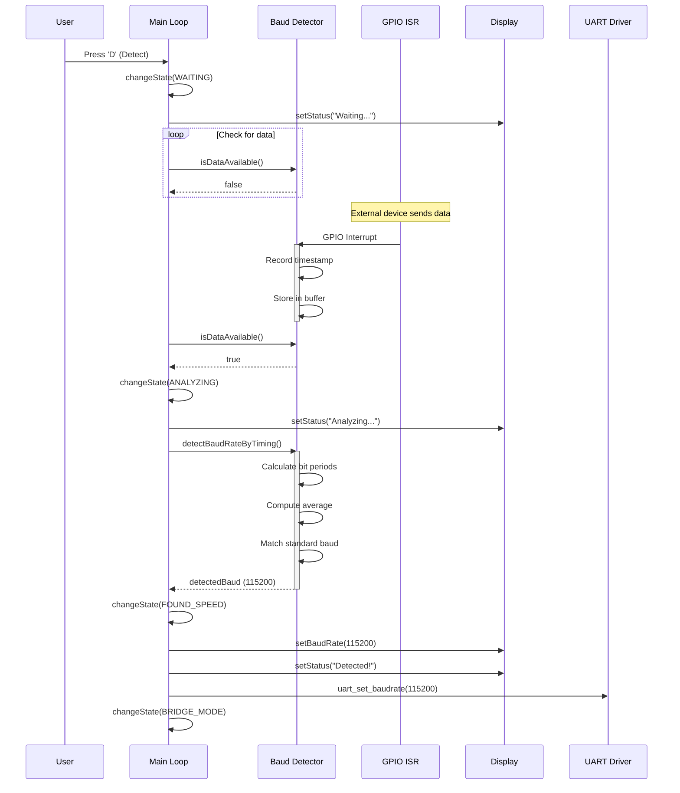
```mermaid
sequenceDiagram
    participant USER as User
    participant MAIN as Main Loop
    participant BAUD as Baud Detector
    participant GPIO as GPIO ISR
    participant DISP as Display
    participant UART as UART Driver
    
    USER->>MAIN: Press 'D' (Detect)
    MAIN->>MAIN: changeState(WAITING)
    MAIN->>DISP: setStatus("Waiting...")
    
    loop Check for data
        MAIN->>BAUD: isDataAvailable()
        BAUD-->>MAIN: false
    end
    
    Note over GPIO: External device sends data
    
    GPIO->>BAUD: GPIO Interrupt
    activate BAUD
    BAUD->>BAUD: Record timestamp
    BAUD->>BAUD: Store in buffer
    deactivate BAUD
    
    MAIN->>BAUD: isDataAvailable()
    BAUD-->>MAIN: true
    
    MAIN->>MAIN: changeState(ANALYZING)
    MAIN->>DISP: setStatus("Analyzing...")
    
    MAIN->>BAUD: detectBaudRateByTiming()
    activate BAUD
    
    BAUD->>BAUD: Calculate bit periods
    BAUD->>BAUD: Compute average
    BAUD->>BAUD: Match standard baud
    BAUD-->>MAIN: detectedBaud (115200)
    deactivate BAUD
    
    MAIN->>MAIN: changeState(FOUND_SPEED)
    MAIN->>DISP: setBaudRate(115200)
    MAIN->>DISP: setStatus("Detected!")
    
    MAIN->>UART: uart_set_baudrate(115200)
    MAIN->>MAIN: changeState(BRIDGE_MODE)
```

### BLE Command Processing

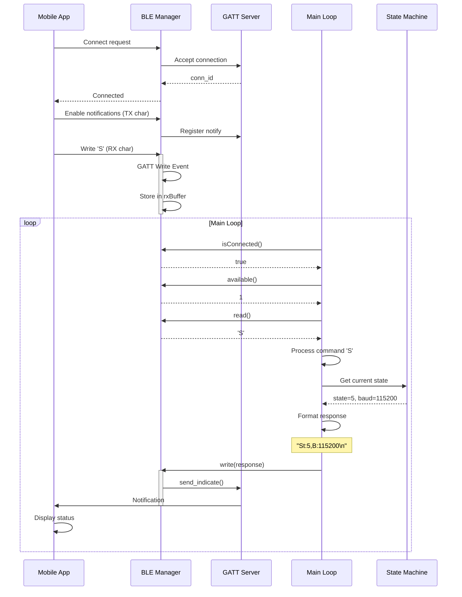
```mermaid
sequenceDiagram
    participant APP as Mobile App
    participant BLE as BLE Manager
    participant GATTS as GATT Server
    participant MAIN as Main Loop
    participant STATE as State Machine
    
    APP->>BLE: Connect request
    BLE->>GATTS: Accept connection
    GATTS-->>BLE: conn_id
    BLE-->>APP: Connected
    
    APP->>BLE: Enable notifications (TX char)
    BLE->>GATTS: Register notify
    
    APP->>BLE: Write 'S' (RX char)
    activate BLE
    BLE->>BLE: GATT Write Event
    BLE->>BLE: Store in rxBuffer
    deactivate BLE
    
    loop Main Loop
        MAIN->>BLE: isConnected()
        BLE-->>MAIN: true
        MAIN->>BLE: available()
        BLE-->>MAIN: 1
        
        MAIN->>BLE: read()
        BLE-->>MAIN: 'S'
        
        MAIN->>MAIN: Process command 'S'
        MAIN->>STATE: Get current state
        STATE-->>MAIN: state=5, baud=115200
        
        MAIN->>MAIN: Format response
        Note over MAIN: "St:5,B:115200\n"
        
        MAIN->>BLE: write(response)
        activate BLE
        BLE->>GATTS: send_indicate()
        GATTS->>APP: Notification
        deactivate BLE
        
        APP->>APP: Display status
    end
```

### Bridge Mode Operation

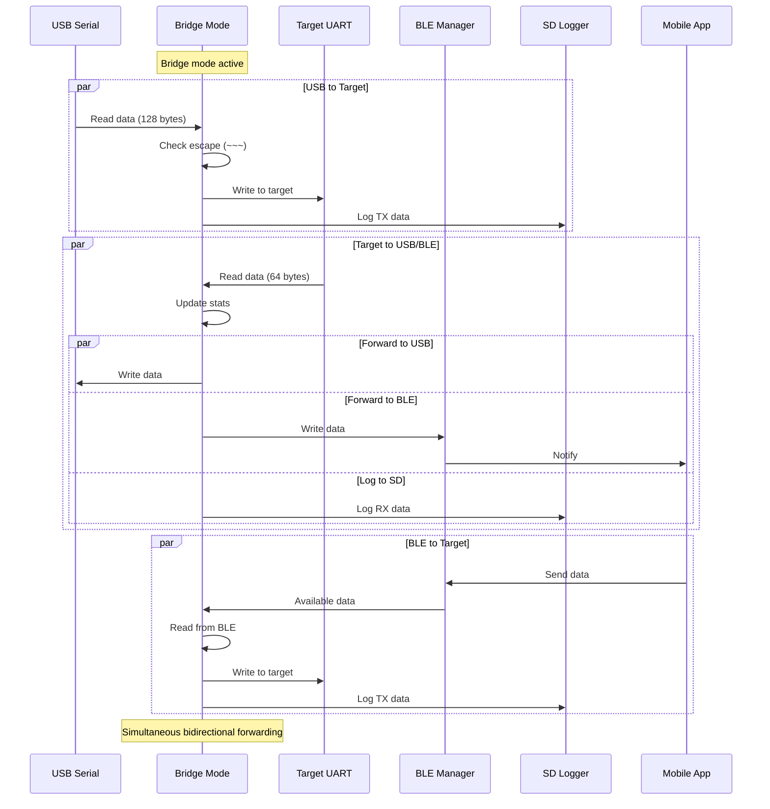
```mermaid
sequenceDiagram
    participant USB as USB Serial
    participant BRIDGE as Bridge Mode
    participant UART as Target UART
    participant BLE as BLE Manager
    participant SD as SD Logger
    participant APP as Mobile App
    
    Note over BRIDGE: Bridge mode active
    
    par USB to Target
        USB->>BRIDGE: Read data (128 bytes)
        BRIDGE->>BRIDGE: Check escape (~~~)
        BRIDGE->>UART: Write to target
        BRIDGE->>SD: Log TX data
    end
    
    par Target to USB/BLE
        UART->>BRIDGE: Read data (64 bytes)
        BRIDGE->>BRIDGE: Update stats
        
        par Forward to USB
            BRIDGE->>USB: Write data
        and Forward to BLE
            BRIDGE->>BLE: Write data
            BLE->>APP: Notify
        and Log to SD
            BRIDGE->>SD: Log RX data
        end
    end
    
    par BLE to Target
        APP->>BLE: Send data
        BLE->>BRIDGE: Available data
        BRIDGE->>BRIDGE: Read from BLE
        BRIDGE->>UART: Write to target
        BRIDGE->>SD: Log TX data
    end
    
    Note over BRIDGE: Simultaneous bidirectional forwarding
```

---

## Hardware Architecture

### Physical Component Diagram

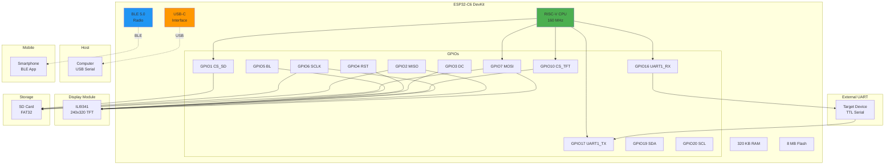
```mermaid
graph TB
    subgraph "ESP32-C6 DevKit"
        CPU[RISC-V CPU<br/>160 MHz]
        RAM[320 KB RAM]
        FLASH[8 MB Flash]
        BT[BLE 5.0<br/>Radio]
        USB_IF[USB-C<br/>Interface]
        
        subgraph "GPIOs"
            GPIO16[GPIO16 UART1_RX]
            GPIO17[GPIO17 UART1_TX]
            GPIO7[GPIO7 MOSI]
            GPIO2[GPIO2 MISO]
            GPIO6[GPIO6 SCLK]
            GPIO10[GPIO10 CS_TFT]
            GPIO1[GPIO1 CS_SD]
            GPIO3[GPIO3 DC]
            GPIO4[GPIO4 RST]
            GPIO5[GPIO5 BL]
            GPIO19[GPIO19 SDA]
            GPIO20[GPIO20 SCL]
        end
    end
    
    subgraph "External UART"
        TARGET[Target Device<br/>TTL Serial]
    end
    
    subgraph "Display Module"
        TFT[ILI9341<br/>240x320 TFT]
    end
    
    subgraph "Storage"
        SD_CARD[SD Card<br/>FAT32]
    end
    
    subgraph "Host"
        PC[Computer<br/>USB Serial]
    end
    
    subgraph "Mobile"
        PHONE[Smartphone<br/>BLE App]
    end
    
    GPIO16 --> TARGET
    TARGET --> GPIO17
    
    GPIO7 --> TFT
    GPIO2 --> TFT
    GPIO6 --> TFT
    GPIO10 --> TFT
    GPIO3 --> TFT
    GPIO4 --> TFT
    GPIO5 --> TFT
    
    GPIO7 --> SD_CARD
    GPIO2 --> SD_CARD
    GPIO6 --> SD_CARD
    GPIO1 --> SD_CARD
    
    USB_IF -.->|USB| PC
    BT -.->|BLE| PHONE
    
    CPU --> GPIO16
    CPU --> GPIO17
    CPU --> GPIO7
    CPU --> GPIO1
    CPU --> GPIO10
    
    style CPU fill:#4CAF50
    style BT fill:#2196F3
    style USB_IF fill:#FF9800
```

### Pin Multiplexing Diagram

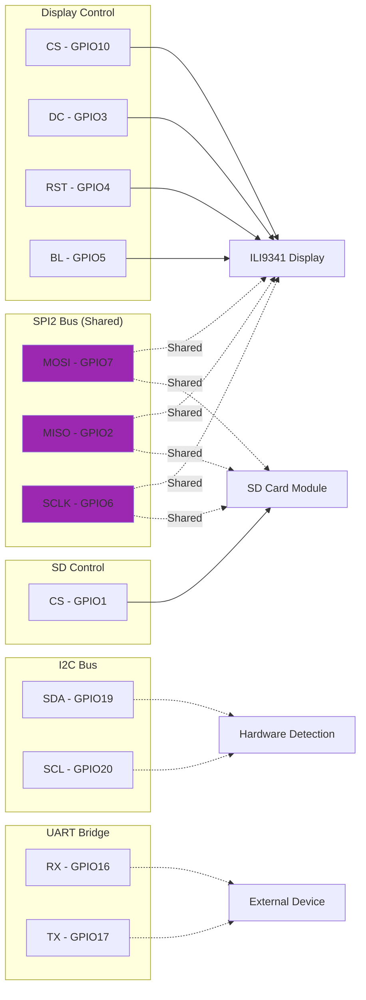
```mermaid
graph LR
    subgraph "SPI2 Bus (Shared)"
        MOSI[MOSI - GPIO7]
        MISO[MISO - GPIO2]
        SCLK[SCLK - GPIO6]
    end
    
    subgraph "Display Control"
        CS_TFT[CS - GPIO10]
        DC[DC - GPIO3]
        RST[RST - GPIO4]
        BL[BL - GPIO5]
    end
    
    subgraph "SD Control"
        CS_SD[CS - GPIO1]
    end
    
    subgraph "I2C Bus"
        SDA[SDA - GPIO19]
        SCL[SCL - GPIO20]
    end
    
    subgraph "UART Bridge"
        RX[RX - GPIO16]
        TX[TX - GPIO17]
    end
    
    MOSI -.->|Shared| TFT[ILI9341 Display]
    MISO -.->|Shared| TFT
    SCLK -.->|Shared| TFT
    CS_TFT --> TFT
    DC --> TFT
    RST --> TFT
    BL --> TFT
    
    MOSI -.->|Shared| SD[SD Card Module]
    MISO -.->|Shared| SD
    SCLK -.->|Shared| SD
    CS_SD --> SD
    
    SDA -.-> DETECT[Hardware Detection]
    SCL -.-> DETECT
    
    RX -.-> UART_EXT[External Device]
    TX -.-> UART_EXT
    
    style MOSI fill:#9C27B0
    style MISO fill:#9C27B0
    style SCLK fill:#9C27B0
```

---

## Software Stack

### Technology Stack Diagram

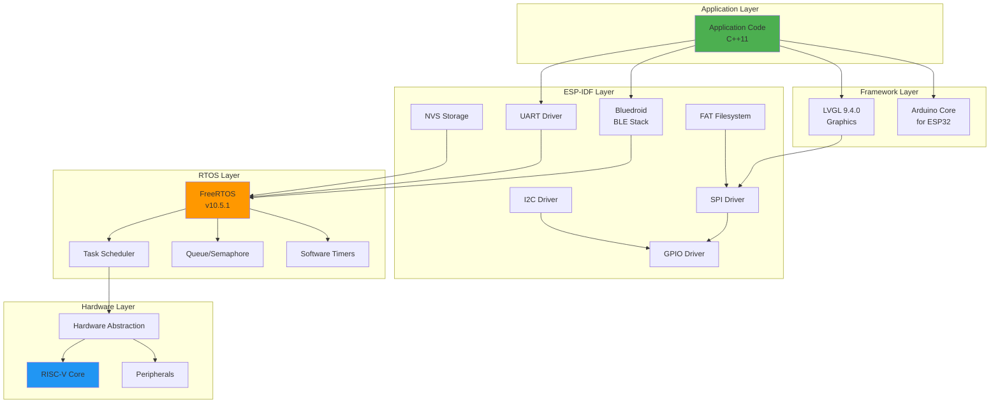
```mermaid
graph TB
    subgraph "Application Layer"
        APP_CODE[Application Code<br/>C++11]
    end
    
    subgraph "Framework Layer"
        LVGL_FW[LVGL 9.4.0<br/>Graphics]
        ARDUINO[Arduino Core<br/>for ESP32]
    end
    
    subgraph "ESP-IDF Layer"
        BLE_STACK[Bluedroid<br/>BLE Stack]
        UART_DRV[UART Driver]
        SPI_DRV[SPI Driver]
        I2C_DRV[I2C Driver]
        GPIO_DRV[GPIO Driver]
        NVS_DRV[NVS Storage]
        FATFS[FAT Filesystem]
    end
    
    subgraph "RTOS Layer"
        FREERTOS[FreeRTOS<br/>v10.5.1]
        TASK[Task Scheduler]
        QUEUE[Queue/Semaphore]
        TIMER[Software Timers]
    end
    
    subgraph "Hardware Layer"
        HAL[Hardware Abstraction]
        RISC_V[RISC-V Core]
        PERIPH[Peripherals]
    end
    
    APP_CODE --> LVGL_FW
    APP_CODE --> ARDUINO
    APP_CODE --> BLE_STACK
    APP_CODE --> UART_DRV
    
    LVGL_FW --> SPI_DRV
    BLE_STACK --> FREERTOS
    UART_DRV --> FREERTOS
    SPI_DRV --> GPIO_DRV
    I2C_DRV --> GPIO_DRV
    NVS_DRV --> FREERTOS
    FATFS --> SPI_DRV
    
    FREERTOS --> TASK
    FREERTOS --> QUEUE
    FREERTOS --> TIMER
    
    TASK --> HAL
    HAL --> RISC_V
    HAL --> PERIPH
    
    style APP_CODE fill:#4CAF50
    style FREERTOS fill:#FF9800
    style RISC_V fill:#2196F3
```

### Memory Architecture

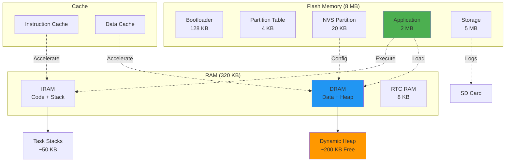
```mermaid
graph TB
    subgraph "Flash Memory (8 MB)"
        BOOT[Bootloader<br/>128 KB]
        PART[Partition Table<br/>4 KB]
        NVS_PART[NVS Partition<br/>20 KB]
        APP[Application<br/>2 MB]
        STORAGE[Storage<br/>5 MB]
    end
    
    subgraph "RAM (320 KB)"
        DRAM[DRAM<br/>Data + Heap]
        IRAM[IRAM<br/>Code + Stack]
        RTCRAM[RTC RAM<br/>8 KB]
    end
    
    subgraph "Cache"
        ICACHE[Instruction Cache]
        DCACHE[Data Cache]
    end
    
    APP -.->|Execute| IRAM
    APP -.->|Load| DRAM
    
    DRAM --> HEAP[Dynamic Heap<br/>~200 KB Free]
    IRAM --> STACK[Task Stacks<br/>~50 KB]
    
    ICACHE -.->|Accelerate| IRAM
    DCACHE -.->|Accelerate| DRAM
    
    NVS_PART -.->|Config| DRAM
    STORAGE -.->|Logs| EXTERNAL[SD Card]
    
    style APP fill:#4CAF50
    style DRAM fill:#2196F3
    style HEAP fill:#FF9800
```

---

## Class Diagrams

### Core Classes

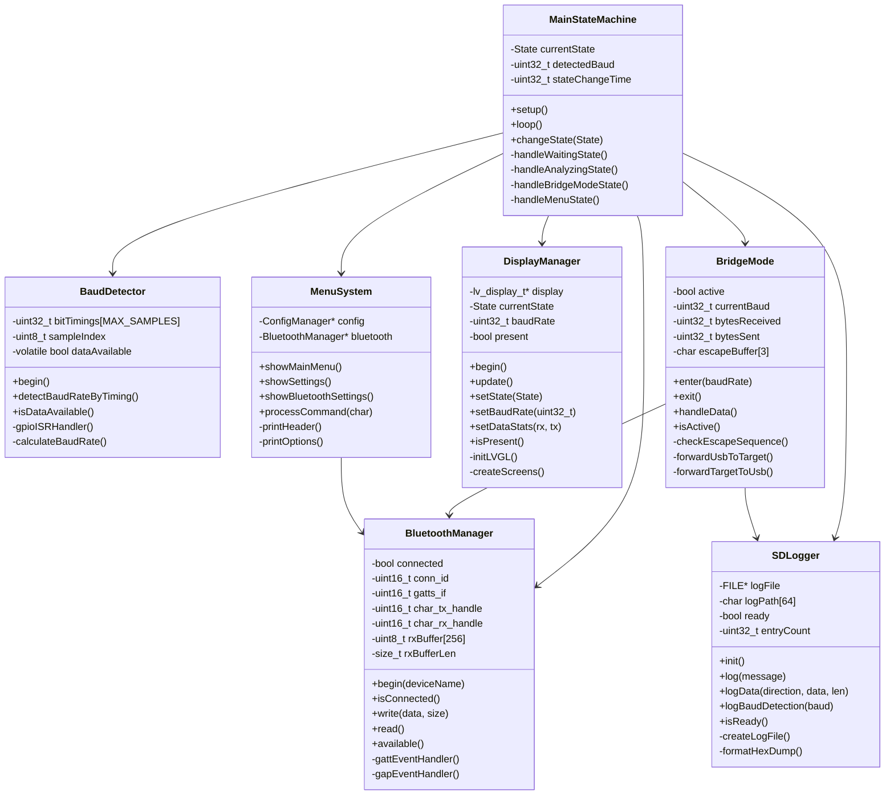
```mermaid
classDiagram
    class MainStateMachine {
        -State currentState
        -uint32_t detectedBaud
        -uint32_t stateChangeTime
        +setup()
        +loop()
        +changeState(State)
        -handleWaitingState()
        -handleAnalyzingState()
        -handleBridgeModeState()
        -handleMenuState()
    }
    
    class BaudDetector {
        -uint32_t bitTimings[MAX_SAMPLES]
        -uint8_t sampleIndex
        -volatile bool dataAvailable
        +begin()
        +detectBaudRateByTiming()
        +isDataAvailable()
        -gpioISRHandler()
        -calculateBaudRate()
    }
    
    class BridgeMode {
        -bool active
        -uint32_t currentBaud
        -uint32_t bytesReceived
        -uint32_t bytesSent
        -char escapeBuffer[3]
        +enter(baudRate)
        +exit()
        +handleData()
        +isActive()
        -checkEscapeSequence()
        -forwardUsbToTarget()
        -forwardTargetToUsb()
    }
    
    class BluetoothManager {
        -bool connected
        -uint16_t conn_id
        -uint16_t gatts_if
        -uint16_t char_tx_handle
        -uint16_t char_rx_handle
        -uint8_t rxBuffer[256]
        -size_t rxBufferLen
        +begin(deviceName)
        +isConnected()
        +write(data, size)
        +read()
        +available()
        -gattEventHandler()
        -gapEventHandler()
    }
    
    class DisplayManager {
        -lv_display_t* display
        -State currentState
        -uint32_t baudRate
        -bool present
        +begin()
        +update()
        +setState(State)
        +setBaudRate(uint32_t)
        +setDataStats(rx, tx)
        +isPresent()
        -initLVGL()
        -createScreens()
    }
    
    class SDLogger {
        -FILE* logFile
        -char logPath[64]
        -bool ready
        -uint32_t entryCount
        +init()
        +log(message)
        +logData(direction, data, len)
        +logBaudDetection(baud)
        +isReady()
        -createLogFile()
        -formatHexDump()
    }
    
    class MenuSystem {
        -ConfigManager* config
        -BluetoothManager* bluetooth
        +showMainMenu()
        +showSettings()
        +showBluetoothSettings()
        +processCommand(char)
        -printHeader()
        -printOptions()
    }
    
    MainStateMachine --> BaudDetector
    MainStateMachine --> BridgeMode
    MainStateMachine --> BluetoothManager
    MainStateMachine --> DisplayManager
    MainStateMachine --> SDLogger
    MainStateMachine --> MenuSystem
    BridgeMode --> BluetoothManager
    BridgeMode --> SDLogger
    MenuSystem --> BluetoothManager
```

### Data Models

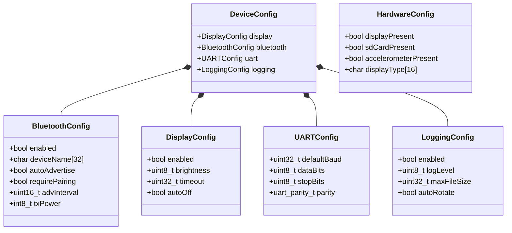
```mermaid
classDiagram
    class DeviceConfig {
        +DisplayConfig display
        +BluetoothConfig bluetooth
        +UARTConfig uart
        +LoggingConfig logging
    }
    
    class BluetoothConfig {
        +bool enabled
        +char deviceName[32]
        +bool autoAdvertise
        +bool requirePairing
        +uint16_t advInterval
        +int8_t txPower
    }
    
    class DisplayConfig {
        +bool enabled
        +uint8_t brightness
        +uint32_t timeout
        +bool autoOff
    }
    
    class UARTConfig {
        +uint32_t defaultBaud
        +uint8_t dataBits
        +uint8_t stopBits
        +uart_parity_t parity
    }
    
    class LoggingConfig {
        +bool enabled
        +uint8_t logLevel
        +uint32_t maxFileSize
        +bool autoRotate
    }
    
    class HardwareConfig {
        +bool displayPresent
        +bool sdCardPresent
        +bool accelerometerPresent
        +char displayType[16]
    }
    
    DeviceConfig *-- BluetoothConfig
    DeviceConfig *-- DisplayConfig
    DeviceConfig *-- UARTConfig
    DeviceConfig *-- LoggingConfig
```

---

## Sequence Diagrams

### Complete User Workflow

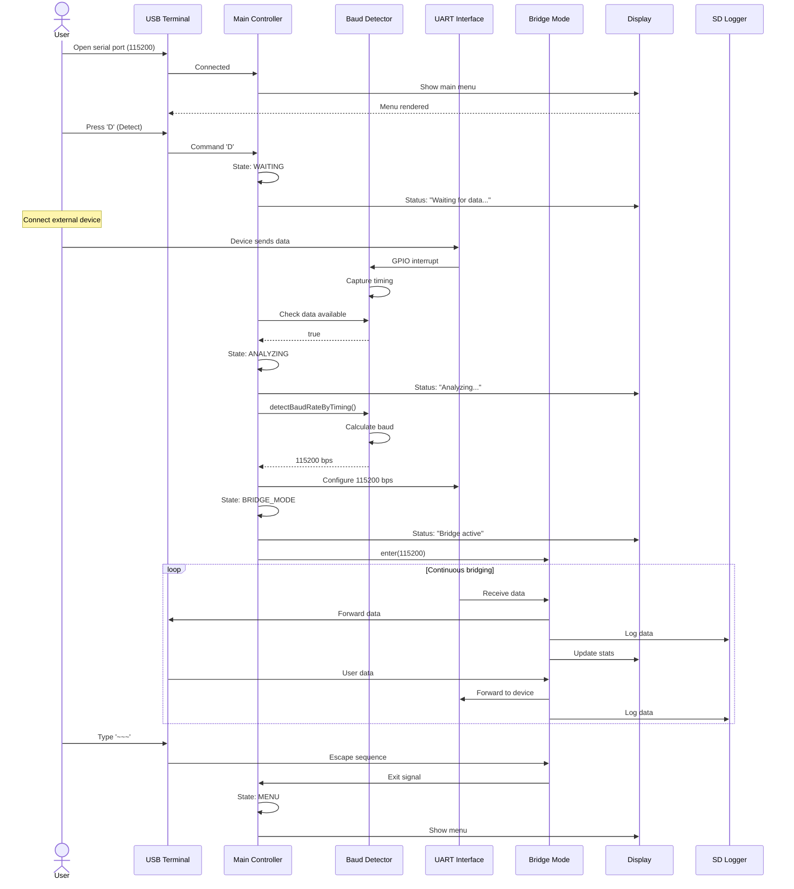
```mermaid
sequenceDiagram
    actor User
    participant Terminal as USB Terminal
    participant Main as Main Controller
    participant Baud as Baud Detector
    participant UART as UART Interface
    participant Bridge as Bridge Mode
    participant Display as Display
    participant SD as SD Logger
    
    User->>Terminal: Open serial port (115200)
    Terminal->>Main: Connected
    Main->>Display: Show main menu
    Display-->>Terminal: Menu rendered
    
    User->>Terminal: Press 'D' (Detect)
    Terminal->>Main: Command 'D'
    Main->>Main: State: WAITING
    Main->>Display: Status: "Waiting for data..."
    
    Note over User: Connect external device
    
    User->>UART: Device sends data
    UART->>Baud: GPIO interrupt
    Baud->>Baud: Capture timing
    
    Main->>Baud: Check data available
    Baud-->>Main: true
    
    Main->>Main: State: ANALYZING
    Main->>Display: Status: "Analyzing..."
    Main->>Baud: detectBaudRateByTiming()
    Baud->>Baud: Calculate baud
    Baud-->>Main: 115200 bps
    
    Main->>UART: Configure 115200 bps
    Main->>Main: State: BRIDGE_MODE
    Main->>Display: Status: "Bridge active"
    Main->>Bridge: enter(115200)
    
    loop Continuous bridging
        UART->>Bridge: Receive data
        Bridge->>Terminal: Forward data
        Bridge->>SD: Log data
        Bridge->>Display: Update stats
        
        Terminal->>Bridge: User data
        Bridge->>UART: Forward to device
        Bridge->>SD: Log data
    end
    
    User->>Terminal: Type '~~~'
    Terminal->>Bridge: Escape sequence
    Bridge->>Main: Exit signal
    Main->>Main: State: MENU
    Main->>Display: Show menu
```

### Error Handling Flow

```mermaid
sequenceDiagram
    participant Component
    participant ErrorHandler
    participant Logger
    participant Display
    participant Recovery
    
    Component->>Component: Operation fails
    Component->>ErrorHandler: reportError(code, msg)
    
    ErrorHandler->>Logger: logError(details)
    Logger->>Logger: Write to SD
    
    ErrorHandler->>Display: showError(message)
    Display->>Display: Render error screen
    
    ErrorHandler->>Recovery: attemptRecovery(code)
    
    alt Recoverable error
        Recovery->>Component: Retry operation
        Component-->>ErrorHandler: Success
        ErrorHandler->>Display: clearError()
    else Non-recoverable error
        Recovery->>Component: Fallback mode
        Component-->>ErrorHandler: Degraded operation
        ErrorHandler->>Display: showWarning()
    else Critical error
        Recovery->>Recovery: Save state
        Recovery->>Component: esp_restart()
    end
```

---

## Deployment Architecture

### Build and Deployment Pipeline

```mermaid
flowchart TB
    START([Developer]) --> COMMIT[Git Commit]
    COMMIT --> PUSH[Push to GitHub]
    
    PUSH --> CI{CI/CD Pipeline}
    
    CI --> BUILD[Build Firmware]
    CI --> TEST[Run Tests]
    CI --> SECURITY[Security Scan]
    CI --> LINT[Code Quality]
    
    BUILD --> ARTIFACT[Generate Artifacts]
    TEST --> REPORT[Test Report]
    SECURITY --> VULN[Vulnerability Report]
    LINT --> QUALITY[Quality Metrics]
    
    ARTIFACT --> PASS{All Checks<br/>Pass?}
    REPORT --> PASS
    VULN --> PASS
    QUALITY --> PASS
    
    PASS -->|Yes| STAGING[Deploy to Staging]
    PASS -->|No| NOTIFY_FAIL[Notify Failure]
    
    STAGING --> QA[QA Testing]
    QA --> APPROVE{Approved?}
    
    APPROVE -->|Yes| RELEASE[Create Release]
    APPROVE -->|No| FEEDBACK[Feedback Loop]
    FEEDBACK --> START
    
    RELEASE --> TAG[Tag Version]
    TAG --> PUBLISH[Publish Binaries]
    PUBLISH --> NOTIFY_SUCCESS[Notify Success]
    
    NOTIFY_FAIL --> START
    NOTIFY_SUCCESS --> END([End Users])
    
    style PASS fill:#4CAF50
    style APPROVE fill:#2196F3
    style RELEASE fill:#FF9800
```

### Runtime Deployment

```mermaid
C4Deployment
    title Deployment Diagram - Runtime Environment

    Deployment_Node(esp32, "ESP32-C6", "Hardware Platform") {
        Deployment_Node(freertos, "FreeRTOS", "RTOS Kernel") {
            Container(main_task, "Main Task", "Priority: 1", "State machine and orchestration")
            Container(lvgl_task, "LVGL Task", "Priority: 2", "Display rendering")
            Container(ble_task, "BLE Task", "Priority: 3", "Bluetooth stack")
        }
        
        Deployment_Node(storage, "Storage", "Non-volatile") {
            ContainerDb(nvs, "NVS", "Configuration storage")
            ContainerDb(flash, "Flash", "Application code")
        }
    }
    
    Deployment_Node(peripherals, "Peripherals", "External Hardware") {
        Container(display, "ILI9341", "SPI", "Display output")
        Container(sd_card, "SD Card", "SPI", "Data logging")
        Container(uart_device, "UART Device", "GPIO", "Target device")
    }
    
    Deployment_Node(host, "Host Computer", "Development/Operation") {
        Container(terminal, "Serial Terminal", "USB", "User interface")
    }
    
    Deployment_Node(mobile, "Smartphone", "Remote Control") {
        Container(ble_app, "nRF Connect", "BLE", "Wireless control")
    }
    
    Rel(main_task, display, "Updates", "SPI")
    Rel(main_task, sd_card, "Logs to", "SPI")
    Rel(main_task, uart_device, "Bridges", "UART")
    Rel(main_task, terminal, "Communicates", "USB CDC")
    Rel(ble_task, ble_app, "Streams data", "BLE")
    Rel(main_task, nvs, "Reads/writes", "NVS API")
```

---

## Performance Characteristics

### Timing Diagram

```mermaid
gantt
    title System Performance Timeline
    dateFormat X
    axisFormat %L ms
    
    section Boot
    Hardware Init       :0, 2000
    Display Init        :2000, 1500
    BLE Init           :3000, 1500
    SD Init            :3500, 1000
    Ready              :milestone, 6000, 0
    
    section Detection
    Wait for Data      :6000, 3000
    GPIO Interrupts    :9000, 1000
    Analysis           :10000, 1000
    Result             :milestone, 11000, 0
    
    section Bridge
    Bridge Active      :11000, 10
    Data Transfer      :11000, 5
    BLE Notify         :11005, 3
    SD Write           :11003, 5
    
    section Response
    BLE Command        :12000, 1
    Process            :12001, 2
    Response           :12003, 3
```

### Throughput Analysis

```mermaid
graph LR
    subgraph "Input Channels"
        USB_IN[USB Serial<br/>115200 bps<br/>~14 KB/s]
        UART_IN[Target UART<br/>9600-115200 bps<br/>1.2-14 KB/s]
        BLE_IN[BLE UART<br/>MTU limited<br/>~1-2 KB/s]
    end
    
    subgraph "Processing"
        BRIDGE[Bridge Processor<br/>Latency: <10ms<br/>Buffer: 256 bytes]
    end
    
    subgraph "Output Channels"
        USB_OUT[USB Serial<br/>115200 bps<br/>~14 KB/s]
        UART_OUT[Target UART<br/>Configured<br/>1.2-14 KB/s]
        BLE_OUT[BLE Notify<br/>MTU: 20-500<br/>~1-2 KB/s]
        SD_OUT[SD Card<br/>SPI Mode<br/>~100 KB/s]
    end
    
    USB_IN -->|High bandwidth| BRIDGE
    UART_IN -->|Variable rate| BRIDGE
    BLE_IN -->|Low bandwidth| BRIDGE
    
    BRIDGE -->|Buffered| USB_OUT
    BRIDGE -->|Buffered| UART_OUT
    BRIDGE -->|Throttled| BLE_OUT
    BRIDGE -->|Async write| SD_OUT
    
    style BRIDGE fill:#FF9800
```

---

## Security Architecture

### Security Layers

```mermaid
graph TB
    subgraph "Application Security"
        INPUT_VAL[Input Validation]
        CMD_AUTH[Command Authorization]
        RATE_LIMIT[Rate Limiting]
    end
    
    subgraph "Communication Security"
        BLE_SEC[BLE Pairing<br/>Optional]
        USB_SEC[USB Enumeration<br/>Standard]
    end
    
    subgraph "Data Security"
        CONFIG_ENC[Config Encryption<br/>NVS]
        LOG_INTEGRITY[Log Integrity<br/>Checksums]
    end
    
    subgraph "Platform Security"
        FLASH_ENC[Flash Encryption<br/>Optional]
        SECURE_BOOT[Secure Boot<br/>Optional]
        STACK_PROT[Stack Protection<br/>FreeRTOS]
    end
    
    INPUT_VAL --> CMD_AUTH
    CMD_AUTH --> RATE_LIMIT
    
    BLE_SEC -.-> INPUT_VAL
    USB_SEC -.-> INPUT_VAL
    
    CONFIG_ENC --> FLASH_ENC
    LOG_INTEGRITY --> CONFIG_ENC
    
    FLASH_ENC --> SECURE_BOOT
    SECURE_BOOT --> STACK_PROT
    
    style INPUT_VAL fill:#4CAF50
    style SECURE_BOOT fill:#F44336
```

---

## Conclusion

This architecture document provides a comprehensive view of SerialyTTY's system design, from high-level components down to detailed interactions and data flows. The modular design ensures:

- **Maintainability:** Clear separation of concerns
- **Extensibility:** Easy to add new features
- **Reliability:** Graceful error handling and recovery
- **Performance:** Optimized for real-time operation
- **Security:** Multiple layers of protection

For implementation details, see:
- **SDLC.md** - Development processes
- **API_DOCUMENTATION.md** - Interface specifications
- **BUILD_GUIDE.md** - Build instructions

---

**Document Version:** 1.0  
**Last Updated:** December 14, 2025  
**Author:** Denis Nisan  
**Status:** Active
