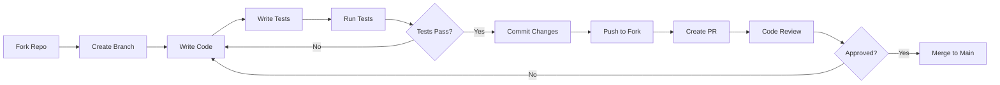

# Contributing to SerialyTTY

First off, thank you for considering contributing to SerialyTTY! It's people like you that make SerialyTTY such a great tool for the embedded systems community.

## Table of Contents

1. [Code of Conduct](#code-of-conduct)
2. [Getting Started](#getting-started)
3. [Development Process](#development-process)
4. [Coding Standards](#coding-standards)
5. [Commit Guidelines](#commit-guidelines)
6. [Pull Request Process](#pull-request-process)
7. [Testing Requirements](#testing-requirements)
8. [Documentation](#documentation)
9. [Issue Reporting](#issue-reporting)
10. [Community](#community)

---

## Code of Conduct

### Our Pledge

We pledge to make participation in our project a harassment-free experience for everyone, regardless of age, body size, disability, ethnicity, gender identity and expression, level of experience, nationality, personal appearance, race, religion, or sexual identity and orientation.

### Our Standards

**Examples of behavior that contributes to a positive environment:**
- Using welcoming and inclusive language
- Being respectful of differing viewpoints and experiences
- Gracefully accepting constructive criticism
- Focusing on what is best for the community
- Showing empathy towards other community members

**Examples of unacceptable behavior:**
- The use of sexualized language or imagery
- Trolling, insulting/derogatory comments, and personal attacks
- Public or private harassment
- Publishing others' private information without permission
- Other conduct which could reasonably be considered inappropriate

### Enforcement

Instances of abusive, harassing, or otherwise unacceptable behavior may be reported by contacting the project team. All complaints will be reviewed and investigated promptly and fairly.

---

## Getting Started

### Prerequisites

Before you begin, ensure you have:
- Git installed
- PlatformIO CLI or VS Code with PlatformIO extension
- ESP32-C6 development board (for hardware testing)
- Basic knowledge of C++ and embedded systems

### Setting Up Development Environment

```bash
# 1. Fork the repository on GitHub

# 2. Clone your fork
git clone https://github.com/YOUR_USERNAME/SerialyTTY.git
cd SerialyTTY

# 3. Add upstream remote
git remote add upstream https://github.com/thenisvan/SerialyTTY.git

# 4. Create a development branch
git checkout -b feature/your-feature-name

# 5. Install dependencies
pio pkg install

# 6. Build the project
pio run -e esp32c6

# 7. Run tests
pio test -e native
```

---

## Development Process

### Workflow Overview



### Branch Naming Convention

Use descriptive branch names with prefixes:

- `feature/` - New features
  - Example: `feature/i2c-protocol-analyzer`
- `bugfix/` - Bug fixes
  - Example: `bugfix/ble-connection-timeout`
- `hotfix/` - Critical production fixes
  - Example: `hotfix/memory-leak-bridge-mode`
- `docs/` - Documentation updates
  - Example: `docs/update-build-guide`
- `refactor/` - Code refactoring
  - Example: `refactor/state-machine-cleanup`
- `test/` - Test additions or updates
  - Example: `test/add-ble-integration-tests`

### Keeping Your Fork Updated

```bash
# Fetch upstream changes
git fetch upstream

# Merge upstream/main into your local main
git checkout main
git merge upstream/main

# Rebase your feature branch on latest main
git checkout feature/your-feature
git rebase main
```

---

## Coding Standards

### C++ Style Guide

Follow the [ESP-IDF C++ Style Guide](https://docs.espressif.com/projects/esp-idf/en/latest/esp32/contribute/style-guide.html) with these additions:

#### File Organization

```cpp
// 1. License header
// Copyright notice

// 2. Include guard (for headers)
#ifndef MODULE_NAME_H
#define MODULE_NAME_H

// 3. System includes
#include <cstdint>
#include <cstring>

// 4. ESP-IDF includes
#include "esp_log.h"
#include "driver/uart.h"

// 5. Third-party includes
#include "lvgl.h"

// 6. Project includes
#include "config.h"
#include "my_module.h"

// 7. Namespace (if used)
namespace serialytty {

// 8. Constants and macros
#define MODULE_TAG "MY_MODULE"
static const int BUFFER_SIZE = 256;

// 9. Type definitions
typedef struct {
    // ...
} my_struct_t;

// 10. Function declarations/definitions

// 11. Close namespace
} // namespace serialytty

// 12. Close include guard
#endif // MODULE_NAME_H
```

#### Naming Conventions

```cpp
// Classes: PascalCase
class BluetoothManager {
};

// Functions: camelCase
void handleBridgeMode() {
}

// Variables: camelCase
int bytesReceived = 0;

// Constants: UPPER_SNAKE_CASE
const int MAX_BUFFER_SIZE = 1024;

// Macros: UPPER_SNAKE_CASE
#define DEBUG_ENABLED 1

// Private members: prefix with underscore (optional)
class Example {
private:
    int _privateValue;
};

// Enums: PascalCase with UPPER_SNAKE_CASE values
enum class State {
    IDLE,
    RUNNING,
    ERROR
};
```

#### Code Formatting

```cpp
// Use 4 spaces for indentation (no tabs)
void exampleFunction() {
    if (condition) {
        doSomething();
    }
}

// Braces on same line for functions and control structures
void function() {
    // code
}

// Space after keywords, no space before parentheses in calls
if (condition) {
    function();
}

// Pointer/reference alignment: attach to type
int* ptr;
const char& ref;

// Maximum line length: 100 characters (soft limit)
// Break long lines at logical points

// Use const wherever possible
void processData(const uint8_t* data, size_t length) {
    // ...
}
```

#### Comments

```cpp
/**
 * @brief Brief description of function
 * 
 * Detailed description of what the function does,
 * including any important implementation notes.
 * 
 * @param data Pointer to input data buffer
 * @param length Length of data in bytes
 * @return Number of bytes processed, or -1 on error
 * 
 * @note This function is not thread-safe
 * @warning Buffer must be at least 'length' bytes
 */
int processData(const uint8_t* data, size_t length) {
    // Implementation
}

// Use single-line comments for brief explanations
int result = calculate(); // Calculate the result

// Use multi-line comments for complex logic
/*
 * This section implements a state machine for...
 * Step 1: ...
 * Step 2: ...
 */
```

### Error Handling

```cpp
// Always check return values
esp_err_t ret = uart_driver_install(...);
if (ret != ESP_OK) {
    ESP_LOGE(TAG, "UART install failed: %s", esp_err_to_name(ret));
    return ret;
}

// Use ESP_RETURN_ON_ERROR for early returns
ESP_RETURN_ON_ERROR(
    uart_set_baudrate(uart_num, baud_rate),
    TAG,
    "Failed to set baud rate"
);

// Check pointers before dereferencing
if (ptr == nullptr) {
    ESP_LOGE(TAG, "Null pointer");
    return ESP_ERR_INVALID_ARG;
}
```

### Memory Management

```cpp
// Use RAII when possible
class ResourceHolder {
public:
    ResourceHolder() {
        data = new uint8_t[SIZE];
    }
    
    ~ResourceHolder() {
        delete[] data;
    }
    
    // Disable copy
    ResourceHolder(const ResourceHolder&) = delete;
    ResourceHolder& operator=(const ResourceHolder&) = delete;
    
private:
    uint8_t* data;
};

// For C-style memory, always free
uint8_t* buffer = (uint8_t*)malloc(size);
if (buffer) {
    // use buffer
    free(buffer);
}

// Prefer stack allocation when possible
uint8_t buffer[256];
```

---

## Commit Guidelines

### Commit Message Format

```
<type>(<scope>): <subject>

<body>

<footer>
```

#### Type
- **feat:** New feature
- **fix:** Bug fix
- **docs:** Documentation only
- **style:** Code style (formatting, semicolons, etc.)
- **refactor:** Code refactoring
- **test:** Adding or updating tests
- **chore:** Maintenance tasks
- **perf:** Performance improvement
- **ci:** CI/CD changes

#### Scope
- Module or component affected: `ble`, `bridge`, `display`, `menu`, etc.

#### Subject
- Use imperative mood: "add" not "added" or "adds"
- Don't capitalize first letter
- No period at the end
- Maximum 50 characters

#### Body (optional)
- Explain the what and why, not the how
- Wrap at 72 characters
- Separate from subject with blank line

#### Footer (optional)
- Reference issues: `Closes #123`, `Fixes #456`
- Breaking changes: `BREAKING CHANGE: description`

### Examples

```
feat(ble): add wireless serial data streaming

Implemented bidirectional data forwarding in bridge mode.
UART data is now forwarded to both USB and BLE connections
simultaneously, allowing wireless monitoring of serial data.

Closes #42
```

```
fix(bridge): handle UART read errors gracefully

Added error handling for UART_NUM_1 read operations when
no device is connected. Error is logged once and then
suppressed to avoid console spam.

Fixes #58
```

```
docs: update README with BLE usage scenarios

Added five real-world usage scenarios with mermaid diagrams
illustrating common BLE workflows. Removed emoji for
professional appearance.
```

---

## Pull Request Process

### Before Creating PR

1. **Update your branch** with latest main
2. **Run all tests** and ensure they pass
3. **Run code formatting** tools
4. **Update documentation** if needed
5. **Add/update tests** for your changes
6. **Run security scan** (Snyk)
7. **Update CHANGELOG.md** if adding features

### PR Template

When creating a PR, use this template:

```markdown
## Description
Brief description of what this PR does.

## Type of Change
- [ ] Bug fix (non-breaking change which fixes an issue)
- [ ] New feature (non-breaking change which adds functionality)
- [ ] Breaking change (fix or feature that would cause existing functionality to not work as expected)
- [ ] Documentation update

## Related Issues
Closes #(issue number)

## Testing
Describe the tests you ran:
- [ ] Unit tests pass
- [ ] Integration tests pass
- [ ] Tested on hardware
- [ ] Manual testing performed

## Checklist
- [ ] My code follows the style guidelines
- [ ] I have performed a self-review of my code
- [ ] I have commented my code, particularly in hard-to-understand areas
- [ ] I have made corresponding changes to the documentation
- [ ] My changes generate no new warnings
- [ ] I have added tests that prove my fix is effective or that my feature works
- [ ] New and existing unit tests pass locally with my changes
- [ ] Any dependent changes have been merged and published

## Screenshots (if applicable)
Add screenshots to help explain your changes.

## Additional Notes
Any additional information or context.
```

### Review Process

1. **Automated checks** must pass (CI/CD pipeline)
2. **At least one approving review** from maintainer
3. **All conversations resolved**
4. **No merge conflicts**
5. **CHANGELOG.md updated** (for user-facing changes)

### After PR is Merged

1. **Delete your branch** (both locally and on fork)
2. **Update your local main** from upstream
3. **Celebrate!** Your contribution is now part of SerialyTTY

---

## Testing Requirements

### Test Coverage

All new code should include:
- **Unit tests** for individual functions
- **Integration tests** for module interactions
- **Hardware tests** for peripheral functionality (if applicable)

Target coverage: **80% minimum**

### Running Tests

```bash
# Run all unit tests
pio test -e native

# Run specific test
pio test -e native -f test_baud_detection

# Run with coverage
pio test -e native --coverage

# Run integration tests on hardware
pio test -e esp32c6
```

### Writing Tests

```cpp
// test/test_example.cpp
#include <unity.h>
#include "module_to_test.h"

void setUp(void) {
    // Set up test fixtures
}

void tearDown(void) {
    // Clean up after test
}

void test_function_returns_expected_value(void) {
    // Arrange
    int input = 42;
    
    // Act
    int result = functionUnderTest(input);
    
    // Assert
    TEST_ASSERT_EQUAL(84, result);
}

void test_function_handles_null_pointer(void) {
    int result = functionUnderTest(nullptr);
    TEST_ASSERT_EQUAL(-1, result);
}

int main(int argc, char **argv) {
    UNITY_BEGIN();
    
    RUN_TEST(test_function_returns_expected_value);
    RUN_TEST(test_function_handles_null_pointer);
    
    return UNITY_END();
}
```

---

## Documentation

### What to Document

- **Public APIs:** All public functions and classes
- **Complex algorithms:** Implementation details and reasoning
- **Configuration:** How to configure and customize
- **Usage examples:** Code snippets showing typical usage
- **Breaking changes:** Migration guides for API changes

### Documentation Standards

```cpp
/**
 * @brief Detects baud rate from timing analysis
 * 
 * Uses GPIO interrupt-based timing to measure bit periods
 * and calculate the baud rate. Supports rates from 9600
 * to 115200 bps with ±0.5% accuracy.
 * 
 * @return Detected baud rate, or 0 if detection fails
 * 
 * @note Requires at least 50 bits for reliable detection
 * @warning This function blocks until detection completes
 * 
 * @see isDataAvailable() to check if data is present
 * 
 * Example usage:
 * @code
 * BaudDetector detector;
 * detector.begin();
 * 
 * uint32_t baud = detector.detectBaudRateByTiming();
 * if (baud > 0) {
 *     printf("Detected: %lu bps\n", baud);
 * }
 * @endcode
 */
uint32_t detectBaudRateByTiming();
```

### Markdown Documentation

- Use clear, descriptive headings
- Include code examples with syntax highlighting
- Add diagrams (mermaid) for complex workflows
- Keep paragraphs concise (3-4 sentences max)
- Use tables for comparison and reference data

---

## Issue Reporting

### Before Creating an Issue

1. **Search existing issues** to avoid duplicates
2. **Check the FAQ** and troubleshooting guide
3. **Try latest version** from main branch
4. **Gather relevant information** (logs, version, hardware)

### Bug Report Template

```markdown
**Describe the bug**
A clear and concise description of what the bug is.

**To Reproduce**
Steps to reproduce the behavior:
1. Go to '...'
2. Click on '....'
3. See error

**Expected behavior**
What you expected to happen.

**Actual behavior**
What actually happened.

**Environment:**
- Version: [e.g., v1.1.0]
- Hardware: [e.g., ESP32-C6 DevKitC-1]
- Peripherals: [e.g., ILI9341 display, SD card]
- PlatformIO version: [e.g., 6.9.0]
- OS: [e.g., macOS 14, Ubuntu 22.04]

**Logs**
```
Paste relevant serial output here
```

**Additional context**
Add any other context about the problem here.
```

### Feature Request Template

```markdown
**Is your feature request related to a problem?**
A clear description of the problem. Ex. I'm frustrated when [...]

**Describe the solution you'd like**
A clear and concise description of what you want to happen.

**Describe alternatives you've considered**
Alternative solutions or features you've considered.

**Additional context**
Add any other context or screenshots about the feature request.

**Implementation ideas (optional)**
If you have ideas about how to implement this, share them here.
```

---

## Community

### Communication Channels

- **GitHub Issues:** Bug reports and feature requests
- **GitHub Discussions:** General questions and community support
- **Pull Requests:** Code contributions and reviews

### Getting Help

If you need help:
1. Check the documentation (README, guides, FAQ)
2. Search GitHub issues for similar problems
3. Create a new issue with detailed information
4. Be patient and respectful

### Recognition

Contributors are recognized in:
- CHANGELOG.md for each release
- README.md contributors section
- GitHub Contributors page

---

## License

By contributing to SerialyTTY, you agree that your contributions will be licensed under:
- **Code:** MIT License
- **Documentation:** CC-BY-4.0

---

## Questions?

If you have questions about contributing, feel free to:
- Open a GitHub Discussion
- Create an issue with the "question" label
- Contact the maintainers

**Thank you for contributing to SerialyTTY!**

---

*Last updated: December 14, 2025*
