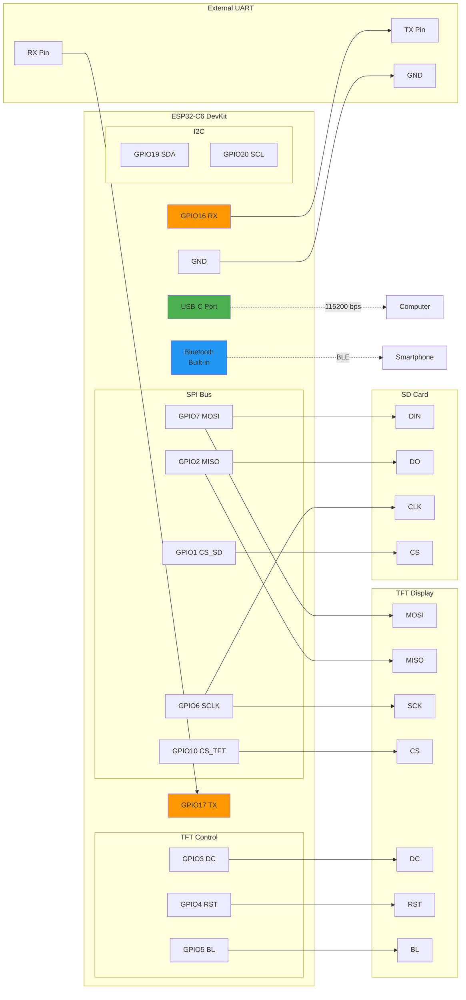
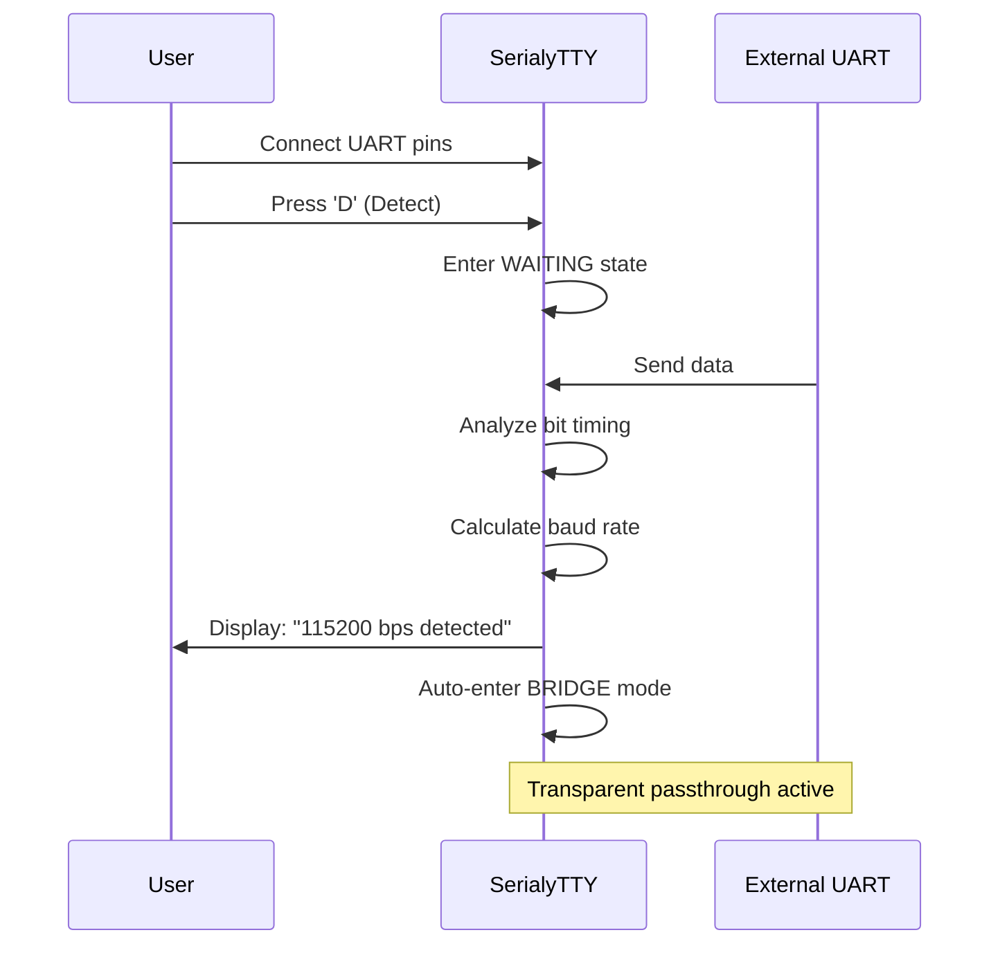
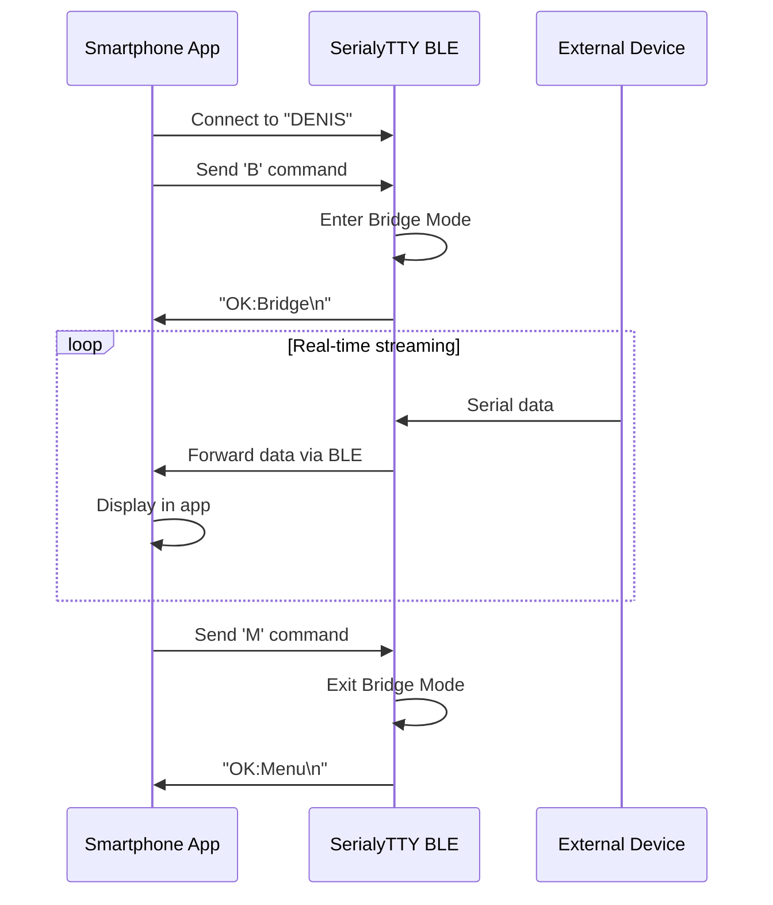
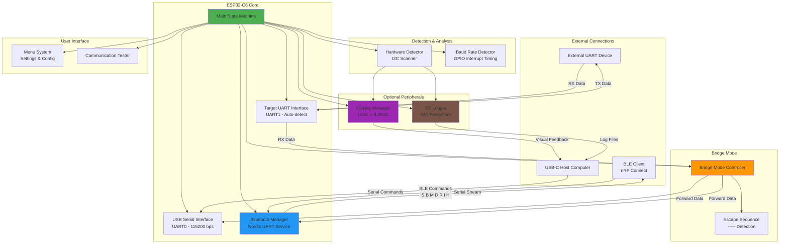
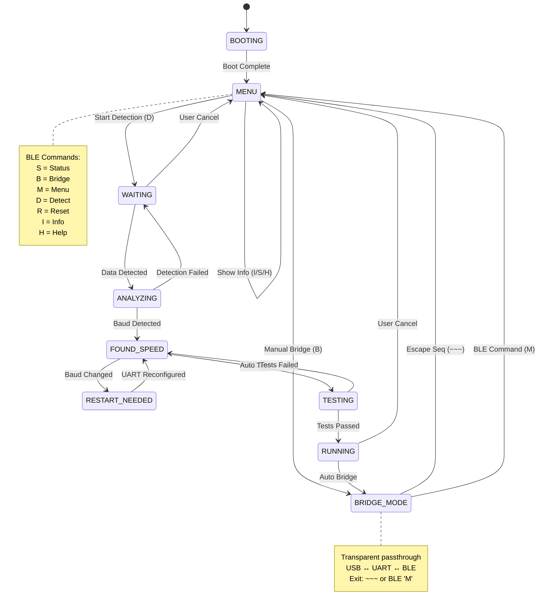
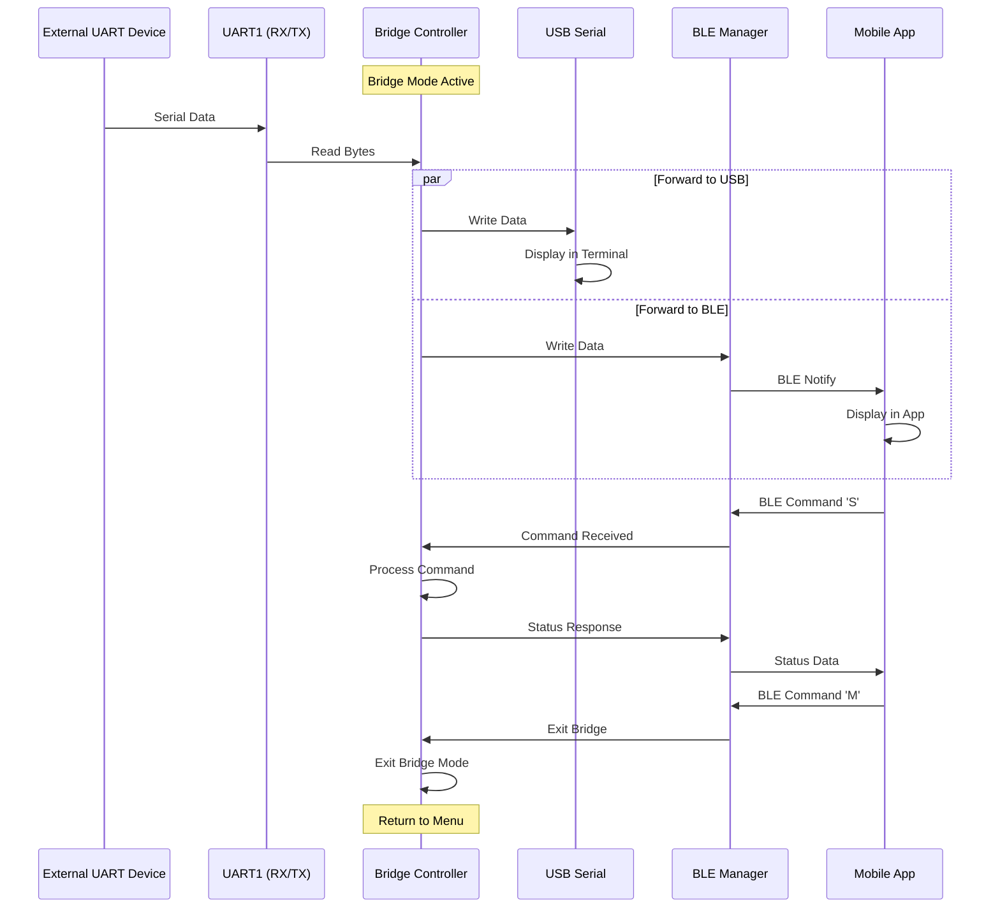
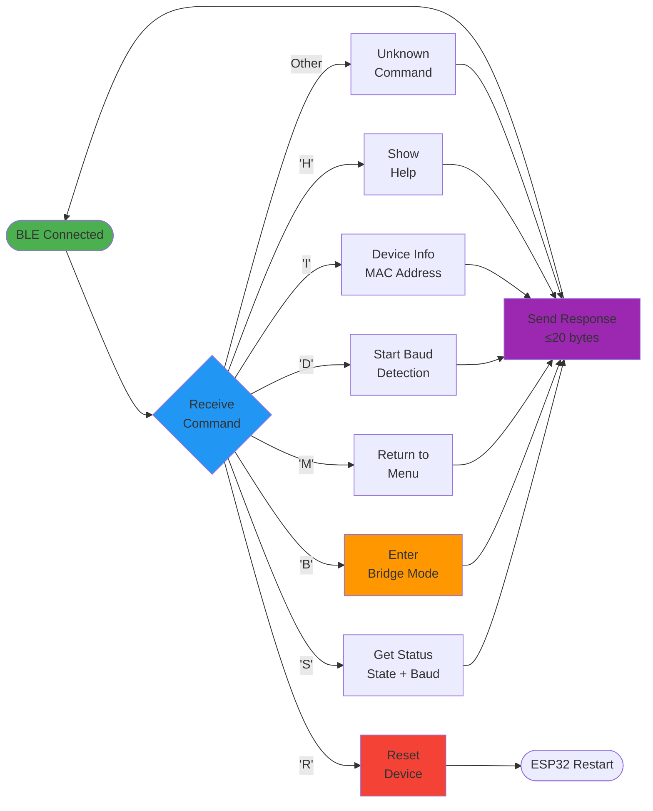

# SerialyTTY - Professional USB-TTL Bridge with Auto Baud Detection & BLE Control

> An intelligent ESP32-C6 USB-to-TTL serial bridge with automatic baud rate detection, TFT display support, SD card logging, Bluetooth Low Energy remote control, and interactive terminal interface.

**Status:** Production Ready with BLE Control  
**License:** Dual License (MIT for code, CC-BY-4.0 for documentation)  
**Repository:** [thenisvan/SerialyTTY](https://github.com/thenisvan/SerialyTTY)  
**Last Updated:** December 14, 2025

---

## Overview

SerialyTTY is a professional-grade USB-to-TTL serial bridge device built on ESP32-C6 that intelligently detects baud rates, bridges serial communication, and provides comprehensive logging and monitoring capabilities. With integrated Bluetooth Low Energy support, you can remotely control the device and view serial data wirelessly. It's designed for developers, embedded engineers, and hardware testers who need reliable serial communication diagnostics.

### Key Features

#### Core Bridge Functionality
- **Intelligent Baud Detection** - Automatic detection from 9600 to 115200 bps using GPIO interrupt-based bit timing analysis
- **Transparent Serial Bridging** - Real-time transparent passthrough with `~~~` escape sequence for mode switching
- **Hardware Auto-Detection** - Automatic scanning for optional peripherals (display, SD card)
- **Graceful Degradation** - Works seamlessly with or without optional hardware

#### Bluetooth Low Energy Control
- **BLE Remote Control** - Wireless device control via Nordic UART Service (NUS)
- **Command Protocol** - Single-letter commands: S(Status), B(Bridge), M(Menu), D(Detect), R(Reset), I(Info), H(Help)
- **Serial Data Streaming** - View UART data wirelessly over Bluetooth in bridge mode
- **Auto-Advertise** - Configurable auto-advertising on boot with customizable device name
- **nRF Connect Compatible** - Works with standard BLE terminal apps

#### Display & Monitoring
- **LVGL Graphics** - Modern UI framework with smooth rendering and touch support
- **ILI9341 TFT Integration** - 240x320 color display with DMA-accelerated graphics
- **Real-Time Statistics** - Live RX/TX byte counters and throughput display
- **Multi-Screen UI** - Boot, Menu, Analyzing, and Bridge screens with professional layout
- **Status Indicators** - Connection status, baud rate, and hardware availability

#### Data Logging & Storage
- **SD Card Support** - FAT filesystem with automatic directory management
- **Timestamped Logs** - `log_YYYYMMDD_HHMMSS.txt` format with structured entries
- **Multiple Log Levels** - INFO, DATA, BAUD, STATE, TEST with binary data support
- **Hex Dump Formatting** - Automatic formatting of binary data for easy analysis
- **Auto-Flush** - Periodic sync to prevent data loss

#### Interactive Interface
- **Professional Menu System** - ANSI-formatted terminal with command-line interface
- **Multiple Modes** - Menu, Bridge, Testing, and Configuration modes
- **Settings Management** - Runtime configuration of UART, Bluetooth, Display, and Logging settings
- **Hardware Information** - Real-time display of detected hardware and status
- **Communication Testing** - Built-in communication tester for device verification

#### Connectivity
- **BLE UART Service** - Full Nordic UART Service implementation with bidirectional data transfer
- **USB Serial** - Full USB-C serial communication at 115200 bps
- **Dual Channel Bridging** - Simultaneous USB and BLE data forwarding

---

## Hardware Requirements

### Essential Hardware
- **ESP32-C6 DevKit** - Minimum: 160 MHz CPU, 320 KB RAM, 8 MB Flash
- **USB-C Cable** - For power and serial communication

### Optional Peripherals
- **ILI9341 TFT Display** - 240x320, SPI interface (recommended for enhanced usability)
- **MicroSD Card Module** - SPI interface with FAT16/FAT32 support (recommended for logging)
- **Target Device** - Any device with UART for bridge testing

---

## Hardware Connections

### Complete Wiring Diagram



### ESP32-C6 Pin Assignments

#### USB-TTL Bridge UART (UART1) - **Required**
| ESP32-C6 | Function | External Device | Notes |
|----------|----------|-----------------|-------|
| GPIO16 | UART1_RXD | Target TX | Receives data from target |
| GPIO17 | UART1_TXD | Target RX | Sends data to target |
| GND | Ground | Target GND | Common ground required |

#### TFT Display (ILI9341) - SPI2 - **Optional**
| ESP32-C6 | Function | Display Pin | Notes |
|----------|----------|-------------|-------|
| GPIO7 | MOSI | D7 (MOSI/SDA) | Data output |
| GPIO2 | MISO | D6 (MISO) | Data input |
| GPIO6 | SCLK | D8 (SCL/SCLK) | Clock signal |
| GPIO10 | CS | CS | Chip select |
| GPIO3 | DC | RS/DC | Data/Command |
| GPIO4 | RST | RESET | Hardware reset |
| GPIO5 | BL | Backlight | PWM brightness |
| 3.3V | Power | VCC | 3.3V only! |
| GND | Ground | GND | Common ground |

#### SD Card Module - SPI2 (Shared Bus) - **Optional**
| ESP32-C6 | Function | SD Module | Notes |
|----------|----------|-----------|-------|
| GPIO7 | MOSI | DIN | Shared with TFT |
| GPIO2 | MISO | DO | Shared with TFT |
| GPIO6 | SCLK | CLK | Shared with TFT |
| GPIO1 | CS | CS | Independent CS |
| 3.3V | Power | VCC | 3.3V regulated |
| GND | Ground | GND | Common ground |

#### Hardware Detection (I2C) - **Auto-configured**
| ESP32-C6 | Function | Purpose |
|----------|----------|---------|
| GPIO19 | SDA | Display detection |
| GPIO20 | SCL | Module scanning |

#### Built-in Bluetooth
- **Protocol:** Bluetooth Low Energy (BLE) 5.0
- **Service:** Nordic UART Service (NUS)
- **Range:** ~10-50 meters (open space)
- **Configuration:** Via Settings menu or `config.h`

---

## Quick Start

### Prerequisites
- **PlatformIO** CLI or VS Code + PlatformIO Extension
- **ESP32-C6 DevKit** connected via USB-C
- **BLE-capable device** (smartphone/tablet) with nRF Connect or Serial Bluetooth Terminal app (optional)
- **External UART device** for testing (optional)

### Build & Upload (5 minutes)

#### Option 1: Using PlatformIO CLI
```bash
# Clone repository
git clone https://github.com/thenisvan/SerialyTTY.git
cd SerialyTTY

# Build for ESP32-C6
platformio run -e esp32c6

# Upload to device
platformio run -e esp32c6 -t upload

# Monitor serial output
platformio device monitor -b 115200
```

#### Option 2: Using VS Code
1. Install PlatformIO IDE extension
2. Open project folder
3. Click **Build** (checkmark) icon in bottom toolbar
4. Click **Upload** (arrow) icon
5. Click **Serial Monitor** (plug) icon

### Expected Boot Sequence
```
I (2330) MAIN: === USB-TTL SNIFFER STARTING ===
I (2340) MAIN: USB Serial initialized
I (2350) HW_DETECT: Scanning for hardware modules...
I (2360) DISPLAY: Display initialization (optional)
I (2530) SD_LOGGER: SD card initialization (optional)
I (3500) BAUD_DETECT: Baud detector initialized
I (4460) BLE_UART: Bluetooth initialized: DENIS
I (4470) BLE_UART: Advertising started
I (5920) DISPLAY: State changed to: Menu
```

### First-Time Setup

#### 1. Connect via USB Serial
```bash
# Linux/macOS
screen /dev/ttyACM0 115200

# Windows
# Use PuTTY or Serial Terminal (COM port, 115200 bps)
```

#### 2. Navigate the Menu
```
╔════════════════════════════════════════╗
║ Main Menu                              ║
╚════════════════════════════════════════╝

  [D] Start Baud Detection
  [B] Manual Bridge Mode
  [S] Show Status
  [I] Hardware Information
  [H] Help
  [2] Settings

Enter option: 
```

#### 3. Connect via Bluetooth (Optional)

**On Android/iOS:**
1. Download **nRF Connect** app from Play Store/App Store
2. Open app and scan for devices
3. Look for **"DENIS"** (or your configured device name)
4. Connect to device
5. Navigate to **Nordic UART Service (6E400001-...)**
6. Enable notifications on **TX Characteristic (6E400003-...)**
7. Send commands via **RX Characteristic (6E400002-...)**

**BLE Commands:**
- `S` - Get device status (state + baud rate)
- `B` - Enter bridge mode
- `M` - Return to menu
- `D` - Start baud detection
- `R` - Reset device
- `I` - Get device info (MAC address)
- `H` - Show help

**Example BLE Session:**
```
> Send: 'S'
< Receive: "St:5,B:115200\n"

> Send: 'I'
< Receive: "MAC:58:8C:81:37:E5:F8\n"

> Send: 'B'
< Receive: "OK:Bridge\n"
(Now in bridge mode - UART data streams to BLE)

> Send: 'M'
< Receive: "OK:Menu\n"
```

---

## Documentation Structure

```
SerialyTTY/
├── README.md                    (This file)
├── USER_GUIDE.md                Complete usage manual
├── API_DOCUMENTATION.md         Developer API reference
├── FAQ_TROUBLESHOOTING.md       Common issues and solutions
├── BUILD_GUIDE.md               Detailed build instructions
├── LINUX_SETUP.md               Linux-specific setup
├── PHASE_3_4_COMPLETE.md        Implementation details
├── INTEGRATION_TEST_PLAN.md     Testing procedures
├── include/                     Header files (public API)
├── src/                         Source code (implementations)
├── platformio.ini               Build configuration
├── CMakeLists.txt               CMake build config
└── sdkconfig.esp32c6            ESP-IDF configuration
```

---

## Usage Scenarios

### Scenario 1: Finding Unknown Baud Rate


**Steps:**
1. Connect target device TX → GPIO16 (RX), GND → GND
2. Power on SerialyTTY
3. Press `D` to start detection
4. Target device sends data
5. SerialyTTY detects baud rate (2-5 seconds)
6. Automatically enters bridge mode
7. View detection result on display or serial output

### Scenario 2: Wireless Serial Monitoring via BLE


**Steps:**
1. Download **nRF Connect** app on your phone
2. Connect external UART device to GPIO16/17
3. Open nRF Connect and scan for "DENIS"
4. Connect and open Nordic UART Service
5. Send `B` command to enter bridge mode
6. View serial data streaming in real-time on your phone
7. Send `M` to return to menu when done

### Scenario 3: Logging Communication Data
**Steps:**
1. Format microSD card as FAT32
2. Insert card into SD module
3. Power on SerialyTTY
4. All communication automatically logged to SD card
5. Files saved as: `log_20251214_143022.txt`
6. Access logs via computer (remove SD card)
7. Analyze binary data with hex dumps

**Example Log File:**
```
[2025-12-14 14:30:22] INFO: System boot
[2025-12-14 14:30:23] INFO: SD card ready
[2025-12-14 14:30:25] BAUD: Detected 115200 bps
[2025-12-14 14:30:26] DATA: RX 12 bytes:
  48 65 6C 6C 6F 20 57 6F 72 6C 64 21  Hello World!
```

### Scenario 4: Remote Device Configuration
**Steps:**
1. Connect via BLE from your phone
2. Send `S` to check current status
3. Navigate to Settings menu via USB terminal
4. Configure Bluetooth name, baud rates, display settings
5. Changes persist across reboots (saved to NVS)
6. Verify with `I` command via BLE

### Scenario 5: Field Testing Without Computer
**Steps:**
1. Power SerialyTTY from power bank
2. Connect to external device
3. Use smartphone with BLE app
4. Control device remotely (D, B, M commands)
5. View serial data on phone screen
6. No laptop required - fully portable!

---

## Architecture Overview

### System Architecture Diagram



### State Machine Flow



### Data Flow in Bridge Mode



### BLE Command Protocol



### Key Modules

| Module | File | Purpose | Features |
|--------|------|---------|----------|
| **Baud Detector** | `baud_detector.cpp` | GPIO interrupt-based baud rate detection | Timing analysis, 9600-115200 bps |
| **UART Bridge** | `bridge_mode.cpp` | Transparent serial passthrough | Bidirectional, escape sequence, BLE forwarding |
| **Bluetooth Manager** | `bluetooth_manager.cpp` | BLE control and data streaming | Nordic UART Service, MTU negotiation, remote control |
| **Display Manager** | `display_manager.cpp` | LVGL-based UI management | Multi-screen layouts, real-time stats |
| **SD Logger** | `sd_logger.cpp` | SD card initialization and logging | Timestamped logs, hex dumps |
| **Menu System** | `menu_system.cpp` | Interactive configuration interface | Settings, hardware info, runtime config |
| **Hardware Detector** | `hardware_detector.cpp` | Peripheral scanning and detection | I2C scanner, auto-detection |
| **Comm Tester** | `comm_tester.cpp` | Communication testing utilities | Test patterns, verification |

---

## Development Workflow

SerialyTTY follows an **Agile Software Development Life Cycle (SDLC)** with continuous integration and deployment. See [SDLC.md](./SDLC.md) for complete details.

### Branch Structure
- **`main`** - Production-ready code, stable releases only
- **`dev`** - Development integration branch
- **`feature/*`** - Individual feature development
- **`bugfix/*`** - Bug fixes
- **`hotfix/*`** - Emergency production fixes

### Contributing
We welcome contributions! Please read [CONTRIBUTING.md](./CONTRIBUTING.md) for:
- Code of conduct
- Development setup
- Coding standards
- Commit message guidelines
- Pull request process
- Testing requirements

### Quick Start for Contributors
```bash
# 1. Fork the repository on GitHub

# 2. Clone your fork
git clone https://github.com/YOUR_USERNAME/SerialyTTY.git
cd SerialyTTY

# 3. Create a feature branch
git checkout -b feature/your-feature-name

# 4. Make your changes and test
pio run -e esp32c6
pio test -e native

# 5. Commit with descriptive message
git commit -m "feat(module): add new feature"

# 6. Push to your fork
git push origin feature/your-feature-name

# 7. Create Pull Request on GitHub
```

### Quality Standards
- **Code Coverage:** >80% for new code
- **Security Scanning:** Snyk integration (zero critical vulnerabilities)
- **Code Review:** Required for all pull requests
- **CI/CD:** Automated testing and building via GitHub Actions
- **Documentation:** All public APIs must be documented

---

## Configuration & Settings

### Runtime Configuration Menu

Access via USB serial by pressing `2` in main menu:

```
╔════════════════════════════════════════╗
║ Settings                               ║
╚════════════════════════════════════════╝

Configuration Categories:
  [1] UART Settings       - Baud rate, parity, stop bits
  [2] Bluetooth Settings  - BLE configuration
  [3] Display Settings    - Brightness, timeout
  [4] Logging Settings    - Log level, file size
  [5] System Settings     - Device name, timezone

  [0] Factory Reset
  [M] Back to Main Menu
```

### Bluetooth Configuration

```
Current Bluetooth Configuration:
  Status: ENABLED
  Device Name: "DENIS"
  Auto-Advertise on Boot: [ON]
  Require Pairing: [OFF]
  Advertising Interval: 100 ms
  TX Power: 0 dBm

Options:
  [E] Enable/Disable Bluetooth
  [N] Change Device Name
  [A] Toggle Auto-Advertise
  [P] Toggle Pairing Requirement
  [I] Set Advertising Interval
  [T] Set TX Power (−12 to +9 dBm)
```

### Build-Time Configuration

Edit `include/config.h` before building:

```cpp
// Bluetooth Settings
#define BLE_DEVICE_NAME "DENIS"
#define BLE_AUTO_ADVERTISE true
#define BLE_MTU_SIZE 500

// UART Settings
#define DEFAULT_BAUD_RATE 115200
#define UART_RX_PIN GPIO_NUM_16
#define UART_TX_PIN GPIO_NUM_17

// Display Settings
#define DISPLAY_ENABLED true
#define DISPLAY_BRIGHTNESS 200  // 0-255
#define DISPLAY_TIMEOUT_MS 60000

// Logging Settings
#define SD_LOG_ENABLED true
#define LOG_BUFFER_SIZE 512
```

### Persistent Storage (NVS)

Settings are saved to ESP32 Non-Volatile Storage:
- Bluetooth device name
- Auto-advertise preference
- UART configurations
- Display preferences
- Survives power cycles and resets

**Reset to defaults:**
- Press `0` in Settings menu
- Or hold BOOT button during power-on (if implemented)

## Performance Specifications

| Feature | Value | Notes |
|---------|-------|-------|
| **CPU Speed** | 160 MHz | RISC-V single-core |
| **RAM Available** | 320 KB total | ~200 KB free after system |
| **Flash Storage** | 8 MB (2 MB used) | 51% utilization |
| **Baud Rate Range** | 9600 - 115200 bps | Auto-detection |
| **Detection Speed** | 2-5 seconds | Depends on data rate |
| **Detection Accuracy** | ±0.5% | Interrupt-based timing |
| **RX Buffer Size** | 1 KB | Per UART |
| **TX Buffer Size** | 1 KB | Per UART |
| **BLE MTU** | 20-500 bytes | Negotiated per connection |
| **BLE Range** | 10-50 meters | Open space, ideal conditions |
| **BLE Latency** | <100 ms | Command response time |
| **Display Refresh** | 20 Hz (50 ms) | LVGL with DMA |
| **Log Flush Interval** | Every 10 entries | Or every 5 seconds |
| **Max Log File Size** | SD card capacity | FAT32 filesystem |
| **Power Consumption** | ~150-200 mA | @ 5V USB (BLE active) |

---

## Troubleshooting

### Device Not Detected (USB)
**Symptoms:** Computer doesn't recognize ESP32-C6
- Ensure USB-C cable is **data-capable** (not charge-only)
- Try different USB port (prefer USB 3.0 ports)
- Check Device Manager (Windows) or `ls /dev/tty*` (Linux/macOS)
- Install CP210x or CH340 drivers if needed
- Press BOOT button while plugging in to enter download mode

### BLE Connection Issues
**Symptoms:** Can't find or connect to device

**Device not advertising:**
```bash
# Check serial output for:
I (4460) BLE_UART: Bluetooth initialized: DENIS
I (4470) BLE_UART: Advertising started
```
- Verify Bluetooth is enabled in Settings menu
- Check `BLE_AUTO_ADVERTISE` in config.h
- Restart device after changing BLE settings
- Ensure no other device is already connected

**Can't connect:**
- Close other BLE apps on your phone
- Turn Bluetooth off/on on your phone
- Clear Bluetooth cache (Android: Settings → Apps → Bluetooth → Storage → Clear Cache)
- Try different BLE app (nRF Connect recommended)
- Check distance (should be < 5 meters initially)

**Connected but no response:**
- Verify you're writing to **RX Characteristic (6E400002)**
- Enable notifications on **TX Characteristic (6E400003)**
- Commands are **single letters** only: S, B, M, D, R, I, H
- Check serial monitor for debug logs: `I (12345) MAIN: BLE command received: 'S'`

### UART Driver Errors in Bridge Mode
**Symptoms:** `E (44413) uart: uart_read_bytes(1492): uart driver error`

This is normal if **no device is connected** to UART1:
- Connect external device to GPIO16 (RX) and GPIO17 (TX)
- Ensure common ground connection
- Error is suppressed after first occurrence
- Does not affect functionality

### Baud Detection Fails
**Symptoms:** Stays in WAITING or ANALYZING state
- Ensure target device is **actively sending data**
- Check physical connections: TX → GPIO16, GND → GND
- Verify target device is powered on
- Try sending continuous data (e.g., `cat /dev/urandom > /dev/ttyUSB0`)
- Supported range: 9600-115200 bps only

### SD Card Not Recognized
**Symptoms:** No logs created, error in serial output
- Format SD card as **FAT32** (not exFAT or NTFS)
- Use cards ≤ 32 GB (SDHC compatibility)
- Check CS pin connection (GPIO1)
- Verify 3.3V power to SD module (not 5V!)
- Try different SD card or module
- Check SPI bus sharing with display

### Display Shows Garbage or Doesn't Work
**Symptoms:** Random pixels, blank screen, or boot loop
- Verify **all** display connections, especially:
  - DC (GPIO3) - must be correct
  - RST (GPIO4) - hardware reset required
  - CS (GPIO10) - chip select
- Check power: ILI9341 requires stable 3.3V
- Verify display is 240x320 ILI9341 (not compatible with other controllers)
- Try disabling display: Set `display.enabled = false` in Settings
- Measure voltages with multimeter

### High Memory Usage
**Symptoms:** Crashes, reboots, or "out of memory" errors
```bash
# Check RAM usage in serial output:
RAM:   [=         ]   9.6% (used 31480 bytes from 327680 bytes)
```
- LVGL uses ~64 KB for framebuffer
- Reduce `LV_DRAW_BUF_SIZE` in lv_conf.h if needed
- Disable unused features (display, SD, BLE) to save RAM
- Monitor with `esp_get_free_heap_size()`

### Serial Data Corruption
**Symptoms:** Garbled text, missing bytes
- Check baud rate matches between devices
- Verify ground connection is solid
- Use shorter wires (< 30 cm recommended)
- Add 100 Ω resistors in series with RX/TX lines
- Check for electrical noise sources nearby

### BLE Data Truncation
**Symptoms:** Responses cut off at 20 bytes
This is expected due to BLE MTU limits:
- MTU negotiation may fail on some devices
- Responses are kept < 20 bytes for compatibility
- Full data logging still works via USB serial and SD card
- Use USB serial for verbose output

### Build/Upload Failures
**Symptoms:** Compilation errors or upload timeouts

**Flash size mismatch:**
```
Warning! Flash memory size mismatch detected. Expected 8MB, found 2MB!
```
- This is a configuration warning, can be ignored
- Actual flash size detected correctly at runtime

**Upload timeouts:**
- Press and hold BOOT button during upload
- Disconnect peripherals during upload (especially display)
- Try different USB cable or port
- Reduce upload speed in platformio.ini:
  ```ini
  upload_speed = 460800  # Default: 921600
  ```

### Reset Loop or Boot Issues
**Symptoms:** Device repeatedly reboots
- Check serial output for panic messages
- Disable peripherals one by one to isolate issue
- Verify power supply provides adequate current (≥500 mA)
- Check for short circuits on GPIO pins
- Erase flash and re-upload: `pio run -t erase`

See **FAQ_TROUBLESHOOTING.md** for more detailed solutions and advanced debugging.

---

## Additional Resources

### User Documentation
- [User Guide](./USER_GUIDE.md) - Complete usage manual
- [FAQ & Troubleshooting](./FAQ_TROUBLESHOOTING.md) - Common issues
- [Build Guide](./BUILD_GUIDE.md) - Detailed build instructions
- [Linux Setup](./LINUX_SETUP.md) - Linux-specific instructions

### Developer Documentation
- [API Documentation](./API_DOCUMENTATION.md) - Developer reference
- [SDLC Documentation](./SDLC.md) - Software Development Life Cycle
- [Contributing Guide](./CONTRIBUTING.md) - How to contribute
- [Changelog](./CHANGELOG.md) - Version history
- [Integration Tests](./INTEGRATION_TEST_PLAN.md) - Testing procedures

---

## License

This project uses a **dual license** approach:

### Code License (MIT)
All source code (`.cpp`, `.h`, `.py`, configuration files) is licensed under the [MIT License](./LICENSE).

```
Permission is hereby granted, free of charge, to any person obtaining a copy
of this software and associated documentation files (the "Software"), to deal
in the Software without restriction, including without limitation the rights
to use, copy, modify, merge, publish, distribute, sublicense, and/or sell
copies of the Software...
```

### Documentation License (CC-BY-4.0)
All documentation and educational content (`.md` files, guides, methodologies) is licensed under the [Creative Commons Attribution 4.0 International License](./LICENSE-DOCS).

```
You are free to:
• Share — copy and redistribute the material
• Adapt — remix, transform, and build upon the material
Required: Attribution — You must give appropriate credit
```

---

## Contributing

We welcome contributions! Here's how to get involved:

1. **Fork** the repository
2. **Create** a feature branch (`git checkout -b feature/amazing-feature`)
3. **Make** your changes and test thoroughly
4. **Commit** with clear messages (`git commit -m 'Add amazing feature'`)
5. **Push** to your branch (`git push origin feature/amazing-feature`)
6. **Open** a Pull Request with a clear description

### Guidelines
- Follow the existing code style
- Add tests for new features
- Update documentation as needed
- Run security checks: `snyk code scan`
- Ensure all tests pass

---

## Project Status & Roadmap

### Completed Features (v1.0)

| Phase | Feature | Status | Details |
|-------|---------|--------|---------|
| **Phase 1** | Core Bridge & Baud Detection | ✅ Complete | GPIO interrupt timing, 9600-115200 bps |
| **Phase 2** | Menu System & Comm Testing | ✅ Complete | Interactive terminal, ANSI formatting |
| **Phase 3A** | TFT Display Integration | Complete | LVGL 9.4.0, ILI9341, multi-screen UI |
| **Phase 3B** | SD Card Logging | Complete | FAT32, timestamped logs, hex dumps |
| **Phase 4** | Integration & Testing | Complete | Full system integration, stability |
| **Phase 5** | **BLE Remote Control** | **Complete** | Nordic UART Service, wireless control |

### Feature Matrix

| Feature | Status | USB | BLE | Display | SD Card |
|---------|--------|-----|-----|---------|---------|
| **Baud Detection** | ✅ | ✅ | ✅ | ✅ | ✅ |
| **Bridge Mode** | ✅ | ✅ | ✅ | ✅ | ✅ |
| **Command Control** | ✅ | ✅ | ✅ | ➖ | ➖ |
| **Data Streaming** | Yes | Yes | Yes | Yes | Yes |
| **Real-time Stats** | Yes | Yes | Yes | Yes | N/A |
| **Configuration** | Yes | Yes | Partial | Yes | N/A |
| **Logging** | Yes | Yes | N/A | N/A | Yes |

**Legend:** Yes = Implemented | Partial = In Progress | N/A = Not Applicable

### Future Roadmap (v2.0+)

| Phase | Feature | Priority | Est. Effort |
|-------|---------|----------|-------------|
| **Phase 6** | Protocol Analyzers (I2C, SPI, CAN) | High | 4-6 weeks |
| **Phase 7** | Real-Time Data Visualization | Medium | 3-4 weeks |
| **Phase 8** | Dedicated Mobile App | Medium | 6-8 weeks |
| **Phase 9** | Cloud Logging & Analytics | Low | 4-6 weeks |
| **Phase 10** | Logic Analyzer Mode | Medium | 3-4 weeks |
| **Phase 11** | Protocol Decoder Plugins | Low | Ongoing |

### Recent Changes (December 2025)

#### v1.1.0 - BLE Control & Streaming
- Full Bluetooth Low Energy implementation
- Nordic UART Service (6E400001-B5A3-F393-E0A9-E50E24DCCA9E)
- Remote command control (S, B, M, D, R, I, H)
- Wireless serial data streaming in bridge mode
- Auto-advertise configuration
- nRF Connect app compatibility
- Runtime BLE settings menu

#### v1.0.0 - Production Release
- Core baud detection and bridging
- LVGL-based display system
- SD card logging with FAT32
- Interactive menu system
- Hardware auto-detection
- Comprehensive documentation

---

## Support & Community

- **Issues & Bugs:** [GitHub Issues](https://github.com/thenisvan/SerialyTTY/issues)
- **Discussions:** [GitHub Discussions](https://github.com/thenisvan/SerialyTTY/discussions)
- **Documentation:** See repository for comprehensive guides

---

## Author

**Created by:** Denis Nisan (thenisvan)  
**Organization:** SmvIT Development  
**Last Updated:** December 14, 2025

---

## Acknowledgments

- ESP-IDF Community for excellent documentation
- PlatformIO for streamlined development
- All contributors and testers who helped shape SerialyTTY

---

## Quick Reference

### BLE Commands
| Command | Function | Response Format | Example |
|---------|----------|-----------------|---------|
| `S` | Status | `St:<state>,B:<baud>\n` | `St:5,B:115200\n` |
| `B` | Bridge Mode | `OK:Bridge\n` or `ERR:Not menu\n` | `OK:Bridge\n` |
| `M` | Menu | `OK:Menu\n` | `OK:Menu\n` |
| `D` | Detect | `OK:Detecting\n` or `ERR:Not menu\n` | `OK:Detecting\n` |
| `R` | Reset | `Resetting...\n` | (device reboots) |
| `I` | Info | `MAC:<address>\n` | `MAC:58:8C:81:37:E5:F8\n` |
| `H` | Help | `S B M D R I H\n` | Command list |

### USB Serial Commands
| Key | Function | Context |
|-----|----------|---------|
| `D` | Start Detection | Main Menu |
| `B` | Manual Bridge | Main Menu |
| `S` | Show Status | Main Menu |
| `I` | Hardware Info | Main Menu |
| `H` | Help | Main Menu |
| `2` | Settings | Main Menu |
| `~~~` | Exit Bridge | Bridge Mode |
| `M` | Back to Menu | Settings |

### State Transitions
```
BOOTING → MENU → WAITING → ANALYZING → FOUND_SPEED → TESTING → RUNNING → BRIDGE_MODE
                    ↑                                                          ↓
                    └──────────────────── (~~~ or BLE 'M') ──────────────────┘
```

### Pin Quick Reference
| Function | GPIO | Notes |
|----------|------|-------|
| UART RX | 16 | Target TX → here |
| UART TX | 17 | Target RX ← here |
| TFT MOSI | 7 | Shared SPI |
| TFT MISO | 2 | Shared SPI |
| TFT SCK | 6 | Shared SPI |
| TFT CS | 10 | Display select |
| TFT DC | 3 | Data/Command |
| TFT RST | 4 | Reset |
| TFT BL | 5 | Backlight PWM |
| SD CS | 1 | SD select |
| I2C SDA | 19 | Detection |
| I2C SCL | 20 | Detection |

### File Structure
```
SerialyTTY/
├── include/          # Header files (.h)
├── src/             # Source code (.cpp)
├── platformio.ini   # Build config
├── sdkconfig.*      # ESP-IDF config
├── README.md        # This file
├── BUILD_GUIDE.md   # Detailed build steps
└── *.md            # Additional docs
```

### Common Build Commands
```bash
# Build firmware
pio run -e esp32c6

# Build and upload
pio run -e esp32c6 -t upload

# Monitor serial output
pio device monitor -b 115200

# Clean build
pio run -t clean

# Erase flash
pio run -t erase

# Update dependencies
pio pkg update
```

### Useful Links
- [nRF Connect iOS](https://apps.apple.com/app/nrf-connect/id1054362403)
- [nRF Connect Android](https://play.google.com/store/apps/details?id=no.nordicsemi.android.mcp)
- [ESP-IDF Documentation](https://docs.espressif.com/projects/esp-idf/en/latest/esp32c6/)
- [LVGL Documentation](https://docs.lvgl.io/)
- [PlatformIO Docs](https://docs.platformio.org/)
- [Nordic UART Service Spec](https://infocenter.nordicsemi.com/topic/sdk_nrf5_v17.1.0/ble_sdk_app_nus_eval.html)

---

**SerialyTTY - Professional Serial Bridge Solution**

---

*SerialyTTY is open source and welcomes contributions. Star the repository on GitHub if you find it useful.*

*For detailed documentation, see the individual documentation files in the repository.*

*Copyright 2025 Denis Nisan - Licensed under MIT (Code) and CC-BY-4.0 (Documentation)*
