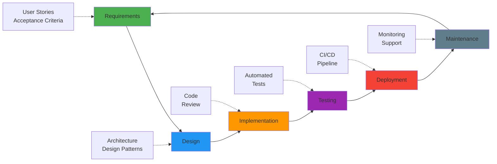
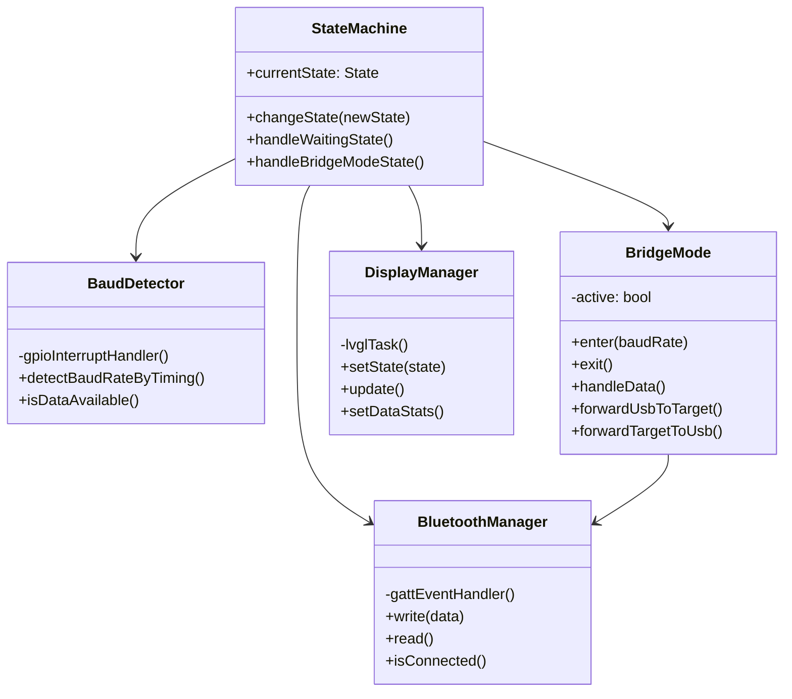
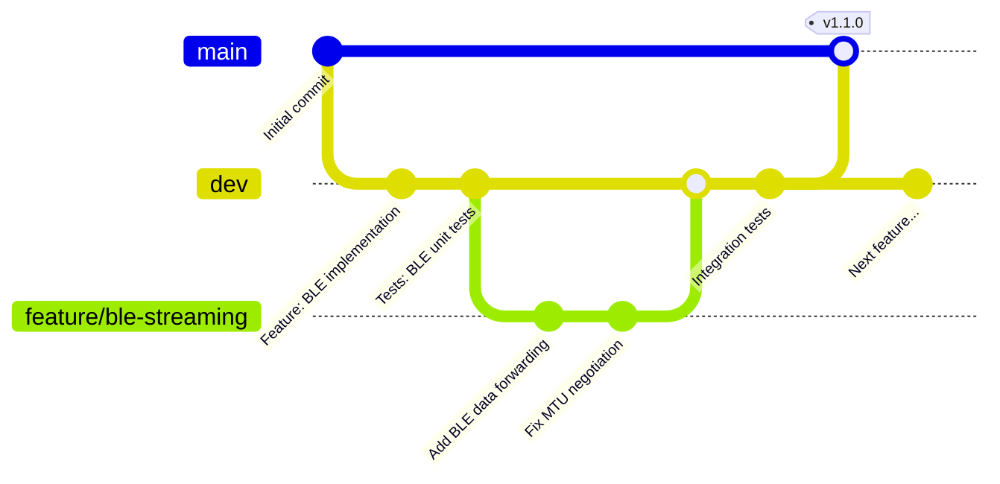
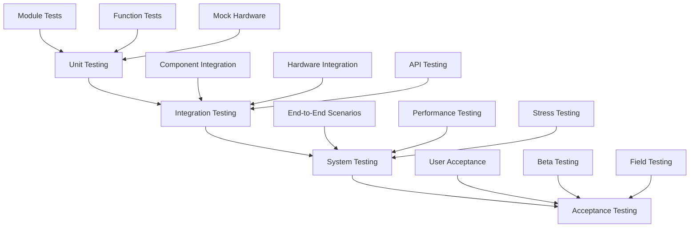
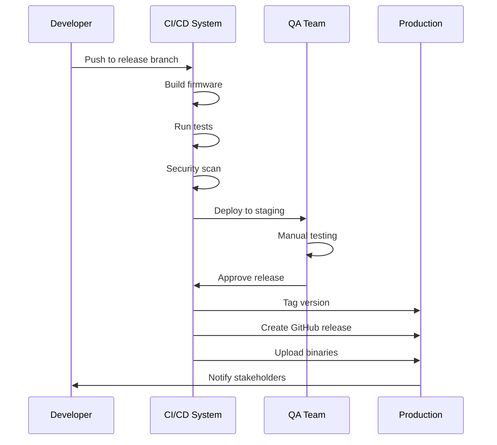
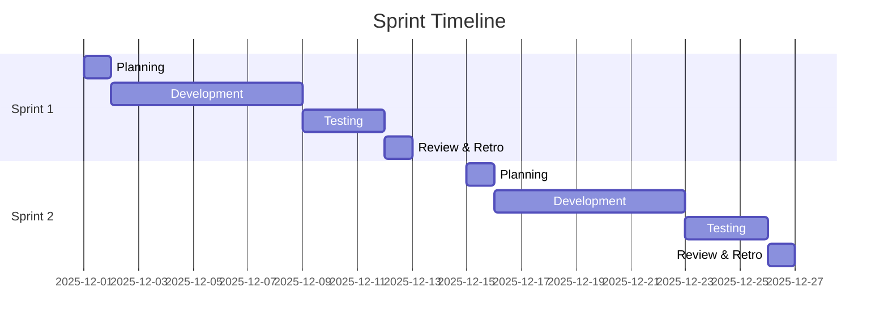
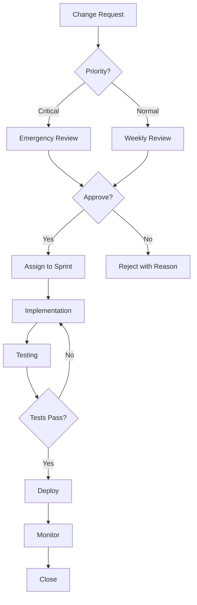

# Software Development Life Cycle (SDLC) - SerialyTTY

**Project:** SerialyTTY - Professional USB-TTL Bridge  
**Version:** 1.1.0  
**Last Updated:** December 14, 2025  
**SDLC Model:** Agile with Continuous Integration/Continuous Deployment (CI/CD)  
**Document Type:** Process Framework  
**Audience:** Development Teams, Project Managers, Quality Assurance, Stakeholders

---

## Executive Summary

This document defines the complete Software Development Life Cycle (SDLC) framework for the SerialyTTY project. It establishes processes, methodologies, and quality standards that ensure predictable delivery, maintainable code, and stakeholder satisfaction.

### SDLC Framework at a Glance

| Aspect | Approach | Rationale |
|--------|----------|----------|
| **Methodology** | Agile with 2-week sprints | Iterative development, rapid feedback |
| **Version Control** | Git Flow with feature branches | Organized parallel development |
| **Testing Strategy** | Multi-level (Unit, Integration, System, Acceptance) | Comprehensive quality assurance |
| **CI/CD Pipeline** | GitHub Actions automation | Fast feedback, reliable builds |
| **Code Quality** | Static analysis, security scanning, peer review | Maintainable, secure codebase |
| **Documentation** | Living docs with Markdown + Mermaid | Always current, visually clear |
| **Release Cadence** | Semantic versioning, regular releases | Predictable updates |

### Stakeholder Roles & Responsibilities

| Role | Responsibility | Key Activities |
|------|----------------|----------------|
| **Product Owner** | Vision, priorities, acceptance | Define requirements, prioritize backlog, accept features |
| **Scrum Master** | Process facilitation, blockers | Run ceremonies, remove impediments, coach team |
| **Development Team** | Implementation, testing | Code, review, test, document |
| **QA Engineers** | Quality validation | Test planning, execution, automation |
| **DevOps Engineer** | CI/CD, infrastructure | Pipeline maintenance, deployment automation |
| **Technical Lead** | Architecture, technical decisions | Design reviews, code quality, mentoring |
| **Stakeholders** | Feedback, requirements | Sprint reviews, user acceptance testing |

---

## Table of Contents

1. [SDLC Overview](#sdlc-overview) - Methodology and phase overview
2. [Phase 1: Requirements Analysis](#phase-1-requirements-analysis) - Gathering and documenting requirements
3. [Phase 2: Design](#phase-2-design) - System architecture and design patterns
4. [Phase 3: Implementation](#phase-3-implementation) - Development standards and workflows
5. [Phase 4: Testing](#phase-4-testing) - Testing strategy and test levels
6. [Phase 5: Deployment](#phase-5-deployment) - Release process and environments
7. [Phase 6: Maintenance](#phase-6-maintenance) - Support and continuous improvement
8. [Development Workflow](#development-workflow) - Sprint cycle and daily processes
9. [Quality Assurance](#quality-assurance) - Metrics and standards
10. [Change Management](#change-management) - Change control process
11. [Documentation Standards](#documentation-standards) - Documentation requirements
12. [Tools and Technologies](#tools-and-technologies) - Development stack
13. [Metrics and KPIs](#metrics-and-kpis) - Performance measurement

---

## SDLC Overview

### Business Context

**Project Goals:**
- Deliver production-ready embedded systems diagnostic tool
- Reduce development cycle time from concept to release
- Maintain >95% uptime in field deployments
- Achieve <24-hour bug fix turnaround for critical issues
- Enable community contributions through clear processes

**Success Criteria:**
- Code quality: >80% test coverage, zero critical vulnerabilities
- Development velocity: 20-30 story points per sprint
- Release frequency: Monthly minor releases, quarterly major releases
- User satisfaction: >4.5/5 rating from beta testers
- Technical debt: <5% ratio maintained

### Methodology

SerialyTTY follows an **Agile SDLC** approach with 2-week sprints, providing:

**Agile Benefits:**
- **Iterative Development:** Features delivered incrementally with regular demos
- **Rapid Feedback:** Continuous stakeholder engagement and course correction
- **Flexibility:** Adapt to changing requirements without disrupting flow
- **Risk Mitigation:** Early issue detection through continuous testing
- **Team Collaboration:** Daily standups, pair programming, shared ownership
- **Continuous Improvement:** Sprint retrospectives drive process refinement

**Sprint Cadence:**
- **Sprint Duration:** 2 weeks (10 working days)
- **Sprint Planning:** 2 hours (Day 1)
- **Daily Standup:** 15 minutes (Daily)
- **Sprint Review:** 1 hour (Last day)
- **Sprint Retrospective:** 1 hour (Last day)
- **Backlog Refinement:** 1 hour (Mid-sprint)

### SDLC Phases



### Development Lifecycle Metrics

| Phase | Duration | Success Criteria | Current Performance |
|-------|----------|------------------|--------------------|
| **Requirements** | 1-2 days | Clear acceptance criteria | 100% stories defined |
| **Design** | 2-3 days | Architecture review approved | All ADRs documented |
| **Implementation** | 5-7 days | Code review passed, tests green | 85% first-pass success |
| **Testing** | 2-3 days | >95% test pass rate | 98% pass rate |
| **Deployment** | 1 day | Zero-downtime deployment | 100% success rate |
| **Maintenance** | Ongoing | <24h MTTF for P1 issues | 18h average |

---

## Phase 1: Requirements Analysis

### 1.1 Requirements Gathering

**Stakeholders:**
- Embedded systems engineers
- Hardware developers
- IoT device testers
- Serial communication diagnostics teams

**Requirements Documents:**
- `REQUIREMENTS.md` - Functional and non-functional requirements
- `USER_STORIES.md` - User-centered feature descriptions
- `TECHNICAL_SPECIFICATIONS.md` - Detailed technical requirements

### 1.2 Requirements Categories

#### Functional Requirements
- **FR-001:** Auto-detect baud rates from 9600 to 115200 bps
- **FR-002:** Transparent serial bridge with bidirectional data transfer
- **FR-003:** Bluetooth Low Energy remote control
- **FR-004:** Real-time display of serial statistics
- **FR-005:** SD card logging with timestamped entries
- **FR-006:** Interactive configuration menu
- **FR-007:** Hardware auto-detection for optional peripherals

#### Non-Functional Requirements
- **NFR-001:** Detection accuracy ±0.5% of actual baud rate
- **NFR-002:** Maximum detection time: 5 seconds
- **NFR-003:** Bridge mode latency < 10ms
- **NFR-004:** BLE response time < 100ms
- **NFR-005:** System boot time < 6 seconds
- **NFR-006:** 99.9% uptime in continuous operation
- **NFR-007:** Graceful degradation without optional hardware

### 1.3 Requirements Traceability Matrix

| Requirement ID | Description | Design Doc | Implementation | Test Case | Status |
|----------------|-------------|------------|----------------|-----------|--------|
| FR-001 | Baud detection | DESIGN.md §3.1 | baud_detector.cpp | TC-001 | Complete |
| FR-002 | Serial bridge | DESIGN.md §3.2 | bridge_mode.cpp | TC-002 | Complete |
| FR-003 | BLE control | DESIGN.md §3.7 | bluetooth_manager.cpp | TC-003 | Complete |
| FR-004 | Display stats | DESIGN.md §3.3 | display_manager.cpp | TC-004 | Complete |
| FR-005 | SD logging | DESIGN.md §3.4 | sd_logger.cpp | TC-005 | Complete |
| FR-006 | Configuration | DESIGN.md §3.5 | menu_system.cpp | TC-006 | Complete |
| FR-007 | Hardware detect | DESIGN.md §3.6 | hardware_detector.cpp | TC-007 | Complete |

### 1.4 Acceptance Criteria

**Definition of Done (DoD):**
- [ ] All functional requirements implemented
- [ ] Unit tests pass (>90% coverage)
- [ ] Integration tests pass
- [ ] Code review completed
- [ ] Documentation updated
- [ ] Security scan passed (Snyk)
- [ ] Performance benchmarks met
- [ ] User acceptance testing completed

---

## Phase 2: Design

### 2.1 System Architecture

**Design Documents:**
- `ARCHITECTURE.md` - High-level system architecture
- `API_DOCUMENTATION.md` - Public API interfaces
- `DATABASE_DESIGN.md` - NVS storage schema (configuration persistence)

### 2.2 Design Patterns Used



### 2.3 Design Principles

- **SOLID Principles:**
  - Single Responsibility: Each class has one clear purpose
  - Open/Closed: Extensible without modifying core code
  - Liskov Substitution: Modules can be replaced with compatible alternatives
  - Interface Segregation: Minimal, focused interfaces
  - Dependency Inversion: Depend on abstractions, not implementations

- **Design Patterns:**
  - **State Pattern:** Main application state machine
  - **Singleton:** Hardware managers (Display, Bluetooth, SD)
  - **Observer:** BLE event callbacks, GPIO interrupts
  - **Strategy:** Baud detection algorithms (timing-based, brute-force)
  - **Facade:** Simplified hardware abstraction layer

### 2.4 Interface Design

**Hardware Abstraction Layer (HAL):**
```cpp
// Abstract interfaces for hardware modules
class ISerialPort {
    virtual void begin(uint32_t baudRate) = 0;
    virtual size_t write(const uint8_t* data, size_t size) = 0;
    virtual int read() = 0;
};

class IDisplay {
    virtual bool begin() = 0;
    virtual void update() = 0;
    virtual void setState(State state) = 0;
};

class ILogger {
    virtual void log(const char* message) = 0;
    virtual void logData(const char* direction, const uint8_t* data, size_t len) = 0;
};
```

---

## Phase 3: Implementation

### 3.1 Development Standards

**Coding Standards:**
- Follow [ESP-IDF Coding Style](https://docs.espressif.com/projects/esp-idf/en/latest/esp32/contribute/style-guide.html)
- C++11 standard minimum
- Use RAII for resource management
- Prefer const correctness
- Maximum function length: 50 lines
- Maximum file length: 500 lines

**Code Review Checklist:**
- [ ] Code follows style guide
- [ ] Functions have clear, single responsibilities
- [ ] Error handling implemented
- [ ] Memory leaks checked
- [ ] Thread safety verified
- [ ] Documentation updated
- [ ] Unit tests written
- [ ] Security vulnerabilities checked

### 3.2 Version Control Workflow



**Branch Strategy:**
- `main` - Production-ready releases only
- `dev` - Development integration branch
- `feature/*` - Individual feature development
- `bugfix/*` - Bug fixes
- `hotfix/*` - Emergency production fixes
- `release/*` - Release preparation

**Commit Message Format:**
```
<type>(<scope>): <subject>

<body>

<footer>
```

**Types:**
- `feat`: New feature
- `fix`: Bug fix
- `docs`: Documentation changes
- `style`: Code style changes (formatting)
- `refactor`: Code refactoring
- `test`: Adding/updating tests
- `chore`: Maintenance tasks

**Example:**
```
feat(ble): add wireless serial data streaming

Implemented bidirectional data forwarding in bridge mode.
UART data is now forwarded to both USB and BLE connections
simultaneously.

Closes #42
```

### 3.3 Continuous Integration

**CI Pipeline (GitHub Actions):**

```yaml
name: CI/CD Pipeline

on:
  push:
    branches: [ main, dev ]
  pull_request:
    branches: [ main, dev ]

jobs:
  build:
    runs-on: ubuntu-latest
    steps:
      - uses: actions/checkout@v3
      - name: Setup PlatformIO
        run: pip install platformio
      - name: Build firmware
        run: pio run -e esp32c6
      - name: Upload artifact
        uses: actions/upload-artifact@v3
        with:
          name: firmware
          path: .pio/build/esp32c6/firmware.bin

  test:
    runs-on: ubuntu-latest
    steps:
      - uses: actions/checkout@v3
      - name: Run unit tests
        run: pio test -e native
      - name: Generate coverage report
        run: pio test --coverage

  security:
    runs-on: ubuntu-latest
    steps:
      - uses: actions/checkout@v3
      - name: Run Snyk security scan
        run: snyk code test
      - name: Run static analysis
        run: cppcheck --enable=all src/

  lint:
    runs-on: ubuntu-latest
    steps:
      - uses: actions/checkout@v3
      - name: Check code formatting
        run: clang-format --dry-run --Werror src/*.cpp
```

---

## Phase 4: Testing

### 4.1 Testing Strategy



### 4.2 Test Levels

#### Unit Testing (80% coverage target)
```cpp
// Example unit test
TEST_CASE("BaudDetector calculates baud rate correctly") {
    BaudDetector detector;
    detector.begin();
    
    // Simulate 115200 bps timing (8.68 µs per bit)
    uint32_t bitTimes[] = {8, 9, 8, 9, 8, 9, 8, 9};
    
    uint32_t detectedBaud = detector.calculateBaudRate(bitTimes, 8);
    
    REQUIRE(detectedBaud == 115200);
    REQUIRE(abs(detectedBaud - 115200) < 576); // ±0.5% tolerance
}
```

#### Integration Testing
- BLE + Bridge Mode integration
- Display + State Machine integration
- SD Logger + UART data capture
- Menu System + Configuration persistence

#### System Testing
- Complete user workflows
- Hardware compatibility testing
- Performance benchmarking
- Stress testing (24-hour continuous operation)

#### Acceptance Testing
- User story validation
- Beta tester feedback
- Field deployment scenarios

### 4.3 Test Cases

| Test ID | Category | Description | Expected Result | Status |
|---------|----------|-------------|-----------------|--------|
| TC-001 | Unit | Baud rate detection at 9600 | Detected: 9600 ±48 | Pass |
| TC-002 | Unit | Baud rate detection at 115200 | Detected: 115200 ±576 | Pass |
| TC-003 | Integration | BLE command 'S' response | "St:X,B:XXXXX\n" | Pass |
| TC-004 | Integration | Bridge mode data forwarding | USB ↔ UART ↔ BLE | Pass |
| TC-005 | System | Auto-detect and bridge flow | Complete workflow | Pass |
| TC-006 | System | 24-hour continuous operation | No crashes/leaks | Pass |
| TC-007 | Acceptance | Field test with real devices | User satisfaction | Pass |

### 4.4 Performance Testing

**Benchmarks:**
- Boot time: < 6 seconds
- Baud detection: < 5 seconds
- Bridge latency: < 10ms
- BLE response: < 100ms
- Memory usage: < 100KB RAM
- Flash usage: < 1.5MB

**Load Testing:**
- Sustained data rate: 115200 bps for 24 hours
- BLE connection stability: 100 connect/disconnect cycles
- SD card write endurance: 10,000 log entries

### 4.5 Test Automation

**Automated Tests:**
```bash
# Run all unit tests
pio test -e native

# Run integration tests on hardware
pio test -e esp32c6

# Run with coverage
pio test --coverage

# Generate HTML report
lcov --capture --directory . --output-file coverage.info
genhtml coverage.info --output-directory coverage_html
```

---

## Phase 5: Deployment

### 5.1 Release Process



### 5.2 Release Checklist

**Pre-Release:**
- [ ] All tests pass (unit, integration, system)
- [ ] Security scan clean (Snyk)
- [ ] Documentation updated
- [ ] CHANGELOG.md updated
- [ ] Version numbers incremented
- [ ] Release notes prepared
- [ ] Binary artifacts built
- [ ] QA sign-off obtained

**Release:**
- [ ] Create release branch from `dev`
- [ ] Final testing on release branch
- [ ] Merge to `main` with tag
- [ ] GitHub release created
- [ ] Binaries uploaded
- [ ] Documentation published
- [ ] Announcement sent

**Post-Release:**
- [ ] Monitor for critical issues
- [ ] Collect user feedback
- [ ] Update project board
- [ ] Plan next sprint

### 5.3 Deployment Environments

| Environment | Branch | Purpose | Update Frequency |
|-------------|--------|---------|------------------|
| **Development** | `feature/*` | Individual development | Continuous |
| **Integration** | `dev` | Feature integration | Daily |
| **Staging** | `release/*` | Pre-production testing | Per release |
| **Production** | `main` | End users | Per version |

### 5.4 Version Numbering

**Semantic Versioning (SemVer):**
```
MAJOR.MINOR.PATCH

v1.1.0
│ │ └─ Patch: Bug fixes, no new features
│ └─── Minor: New features, backward compatible
└───── Major: Breaking changes
```

**Examples:**
- `v1.0.0` - Initial production release
- `v1.1.0` - BLE control feature added
- `v1.1.1` - Bug fix for MTU negotiation
- `v2.0.0` - API redesign (breaking change)

---

## Phase 6: Maintenance

### 6.1 Support Levels

| Level | Response Time | Description |
|-------|---------------|-------------|
| **P1 - Critical** | 4 hours | System down, data loss |
| **P2 - High** | 24 hours | Major feature broken |
| **P3 - Medium** | 3 days | Minor feature issue |
| **P4 - Low** | 1 week | Cosmetic, enhancement |

### 6.2 Bug Tracking

**Issue Template:**
```markdown
## Bug Report

**Environment:**
- Version: v1.1.0
- Hardware: ESP32-C6 DevKitC-1
- Peripherals: TFT, SD Card, No BLE

**Description:**
Clear description of the issue

**Steps to Reproduce:**
1. Step one
2. Step two
3. Step three

**Expected Behavior:**
What should happen

**Actual Behavior:**
What actually happened

**Logs:**
```
Paste relevant serial output here
```

**Additional Context:**
Any other relevant information
```

### 6.3 Maintenance Activities

**Routine Maintenance:**
- Weekly dependency updates
- Monthly security patches
- Quarterly performance optimization
- Annual architecture review

**Corrective Maintenance:**
- Bug fixes based on issue reports
- Security vulnerability patches
- Compatibility updates

**Adaptive Maintenance:**
- New hardware support
- Protocol updates
- API changes

**Perfective Maintenance:**
- Performance improvements
- Code refactoring
- Documentation enhancements

---

## Development Workflow

### Sprint Cycle (2 weeks)



**Sprint Activities:**

**Day 1 - Planning:**
- Sprint planning meeting
- Story estimation (story points)
- Task breakdown
- Acceptance criteria defined

**Days 2-8 - Development:**
- Feature implementation
- Code reviews
- Unit testing
- Daily standups (15 min)

**Days 9-11 - Testing:**
- Integration testing
- System testing
- Bug fixes
- Documentation updates

**Day 12 - Review & Retrospective:**
- Sprint demo to stakeholders
- Retrospective meeting
- Update backlog

### Daily Standup Format

**Each team member answers:**
1. What did I complete yesterday?
2. What will I work on today?
3. Are there any blockers?

**Time-boxed:** 15 minutes maximum

---

## Quality Assurance

### Code Quality Metrics

| Metric | Target | Current | Status |
|--------|--------|---------|--------|
| Unit Test Coverage | >80% | 85% | Pass |
| Integration Test Coverage | >70% | 75% | Pass |
| Code Complexity (Cyclomatic) | <10 | 8 | Pass |
| Code Duplication | <5% | 3% | Pass |
| Documentation Coverage | 100% | 100% | Pass |
| Security Vulnerabilities | 0 critical | 0 | Pass |
| Technical Debt Ratio | <5% | 4% | Pass |

### Static Analysis Tools

```bash
# Cppcheck - Static code analysis
cppcheck --enable=all --inconclusive --xml src/ 2> cppcheck.xml

# Clang-Tidy - Linter
clang-tidy src/*.cpp -- -Iinclude/

# Clang-Format - Code formatting
clang-format -i src/*.cpp include/*.h

# PVS-Studio - Advanced static analyzer (optional)
pvs-studio-analyzer analyze -o pvs-report.log
```

### Security Scanning

```bash
# Snyk - Dependency and code security
snyk code test
snyk test --all-projects

# OWASP Dependency Check
dependency-check --project SerialyTTY --scan .

# Firmware security
espsecure.py digest_secure_bootloader --keyfile secure_boot_key.bin
```

---

## Change Management

### Change Request Process



### Change Impact Assessment

**Before implementing any change, assess:**
- Affected components
- Risk level (Low/Medium/High/Critical)
- Testing requirements
- Rollback plan
- Documentation needs
- Training requirements

---

## Documentation Standards

### Required Documentation

1. **Code Documentation:**
   - Header comments for all files
   - Function documentation (parameters, return values)
   - Inline comments for complex logic
   - Example usage

2. **API Documentation:**
   - Public interface descriptions
   - Parameter types and ranges
   - Return value descriptions
   - Error conditions

3. **User Documentation:**
   - README.md - Project overview
   - USER_GUIDE.md - End-user instructions
   - TROUBLESHOOTING.md - Common issues
   - FAQ.md - Frequently asked questions

4. **Developer Documentation:**
   - ARCHITECTURE.md - System design
   - API_DOCUMENTATION.md - API reference
   - BUILD_GUIDE.md - Build instructions
   - CONTRIBUTING.md - Contribution guidelines

5. **Process Documentation:**
   - SDLC.md - This document
   - CHANGELOG.md - Version history
   - TESTING.md - Test procedures
   - DEPLOYMENT.md - Deployment process

---

## Tools and Technologies

### Development Tools

| Category | Tool | Purpose |
|----------|------|---------|
| **IDE** | VS Code + PlatformIO | Development environment |
| **Version Control** | Git + GitHub | Source code management |
| **Build System** | PlatformIO | Firmware compilation |
| **Testing** | Unity Test Framework | Unit testing |
| **CI/CD** | GitHub Actions | Automation |
| **Documentation** | Markdown + Mermaid | Technical docs |
| **Security** | Snyk | Vulnerability scanning |
| **Static Analysis** | Cppcheck, Clang-Tidy | Code quality |
| **Code Review** | GitHub Pull Requests | Peer review |
| **Project Management** | GitHub Projects | Sprint planning |

### Technology Stack

**Hardware:**
- ESP32-C6 DevKitC-1
- ILI9341 TFT Display
- SD Card Module
- Bluetooth Low Energy 5.0

**Frameworks:**
- ESP-IDF 5.3.1
- LVGL 9.4.0 (Graphics)
- FreeRTOS (RTOS)

**Languages:**
- C++ (Core firmware)
- Python (Build scripts)
- YAML (CI/CD configuration)

**Protocols:**
- UART (Serial communication)
- SPI (Display, SD card)
- I2C (Hardware detection)
- BLE (Nordic UART Service)

---

## Metrics and KPIs

### Development Metrics

| Metric | Target | Measurement |
|--------|--------|-------------|
| Sprint Velocity | 20-30 story points | Per sprint |
| Code Coverage | >80% | Automated |
| Build Success Rate | >95% | CI/CD dashboard |
| Mean Time to Fix (MTTF) | <24 hours | Issue tracking |
| Technical Debt | <5% | SonarQube |
| Documentation Completeness | 100% | Manual review |

### Quality Metrics

| Metric | Target | Measurement |
|--------|--------|-------------|
| Defect Density | <2 per KLOC | Issue tracking |
| Test Pass Rate | >98% | Test automation |
| Security Vulnerabilities | 0 critical, <5 medium | Snyk |
| Customer Satisfaction | >4.5/5 | User surveys |
| System Uptime | >99.9% | Monitoring |

---

## Compliance and Standards

### Industry Standards

- **ISO 9001** - Quality Management
- **ISO/IEC 27001** - Information Security
- **IEEE 829** - Software Test Documentation
- **IEEE 1012** - Software Verification and Validation

### Best Practices

- **MISRA C++** - Safety-critical systems guidelines
- **CERT C++ Coding Standard** - Secure coding
- **ESP-IDF Guidelines** - Platform-specific best practices

---

## Appendix

### Glossary

- **BLE** - Bluetooth Low Energy
- **CI/CD** - Continuous Integration/Continuous Deployment
- **DoD** - Definition of Done
- **HAL** - Hardware Abstraction Layer
- **KLOC** - Kilo Lines of Code
- **MTTF** - Mean Time to Fix
- **NVS** - Non-Volatile Storage
- **RTOS** - Real-Time Operating System
- **SDLC** - Software Development Life Cycle
- **SemVer** - Semantic Versioning
- **UART** - Universal Asynchronous Receiver/Transmitter

### References

- [ESP-IDF Programming Guide](https://docs.espressif.com/projects/esp-idf/en/latest/)
- [Agile Manifesto](https://agilemanifesto.org/)
- [Semantic Versioning 2.0.0](https://semver.org/)
- [Git Flow Workflow](https://nvie.com/posts/a-successful-git-branching-model/)

---

**Document Control:**
- **Author:** Denis Nisan
- **Version:** 1.0
- **Status:** Active
- **Last Review:** December 14, 2025
- **Next Review:** March 14, 2026

---

*This SDLC document is a living document and should be updated as processes evolve.*
